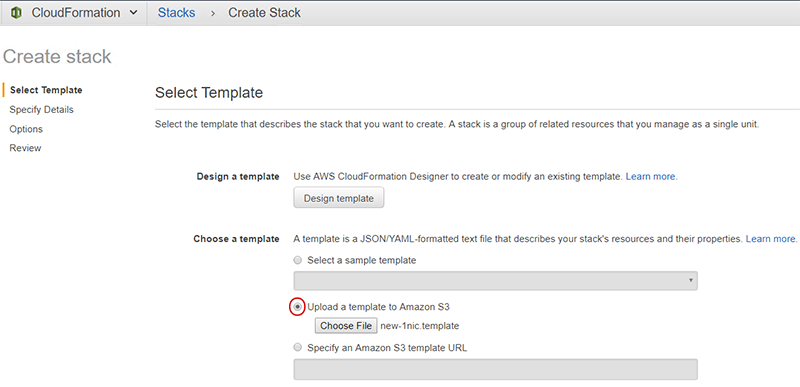

## Changing the BIG-IP VE image in an F5 CFT template
The following procedure describes how to update an F5 AWS CFT template to use a different BIG-IP image than the one referenced in the template.  This is useful if your organization has standardized on a particular version of a template, and the BIG-IP image referenced by the template has been removed from AWS, for reasons such as a vulnerability is discovered in the BIG-IP image used by the template.

Refer to the [AWS CFT Template Matrix](https://github.com/F5Networks/f5-aws-cloudformation/blob/master/aws-bigip-version-matrix.md) to ensure proper compatibility of BIG-IP versions for particular releases.  The BIG-IP version must be in the same family (for example, if you deployed using a v13 image, you use any v13.x image in the template).

*Important*  This procedure is only necessary if you need to modify a template that was contained in a previous tagged release.  If you do not need to use an older template, we recommend using the latest templates.

**To change the BIG-IP VE image in a template**
1.  Determine the F5 CFT template you want to deploy (for example, standalone, 1-NIC).
2.  Select the release Tag that corresponds to the template.  To select the release tag:
    *  Go to the F5 AWS CloudFormation Template main page (https://github.com/F5Networks/f5-aws-cloudformation).  
    *  From the **Branch** list, click the arrow, and then click the **Tags** tab. <br> <br>  
    *  Select the Tagged version that contains the template you want to update.  
3. Copy the contents of the appropriate AMI Map:
    *  Go to https://github.com/F5Networks/f5-aws-cloudformation/tree/master/AMI%20Maps.
    *  Click the folder for the BIG-IP product family you are using (for example, if you are using BIG-IP v13.0, click the directory that starts with **13.0**.)
    *  Click the appropriate region map, depending on whether you are using a BYOL or Hourly image.
    *  Click the Raw button, and then copy the entire content of the file.

4. Browse to the template file which contains the BIG-IP image you want to replace.  For example, for a 1-NIC, BYOL template, we click **supported > standalone > 1nic > f5-existing-stack-byol-1nic-bigip.template**.
5.  Click the **Raw** button and save the file locally.  
6.  Open the template file in a text editor and find the Mappings section.  

    ```
    {  
     "AWSTemplateFormatVersion": "2010-09-09",  
     "Conditions": {  
        "optin": {  
           "Fn::Equals": [  
             "Yes",  
            {  
              "Ref": "allowUsageAnalytics"  
            }  
          ]  
        }  
     },  
     "Description": "Template Version 2.6.1: AWS CloudFormation ....",  
     "Mappings": {  
     "BigipRegionMap": {  
      "ap-northeast-1": {  
        "Best1000Mbps": "ami-3a1c2d5d",   etc, etc.
    
    ```

7.  After the **"BigipRegionMap":**, select everything, including the bracket, until the **Metadata** line, and replace it with the contents of the AMI Map file you copied.
8. Save the new file.
9.  Deploy the CFT template as you typically do.  For example, you can:
    - Use the AWS CLI to deploy the template.  See the individual README file for instructions.
    - Deploy using the AWS CloudFormation UI by uploading the template file.  
      
    - This is not an exhaustive list, simply deploy the new template as you normally would in AWS.