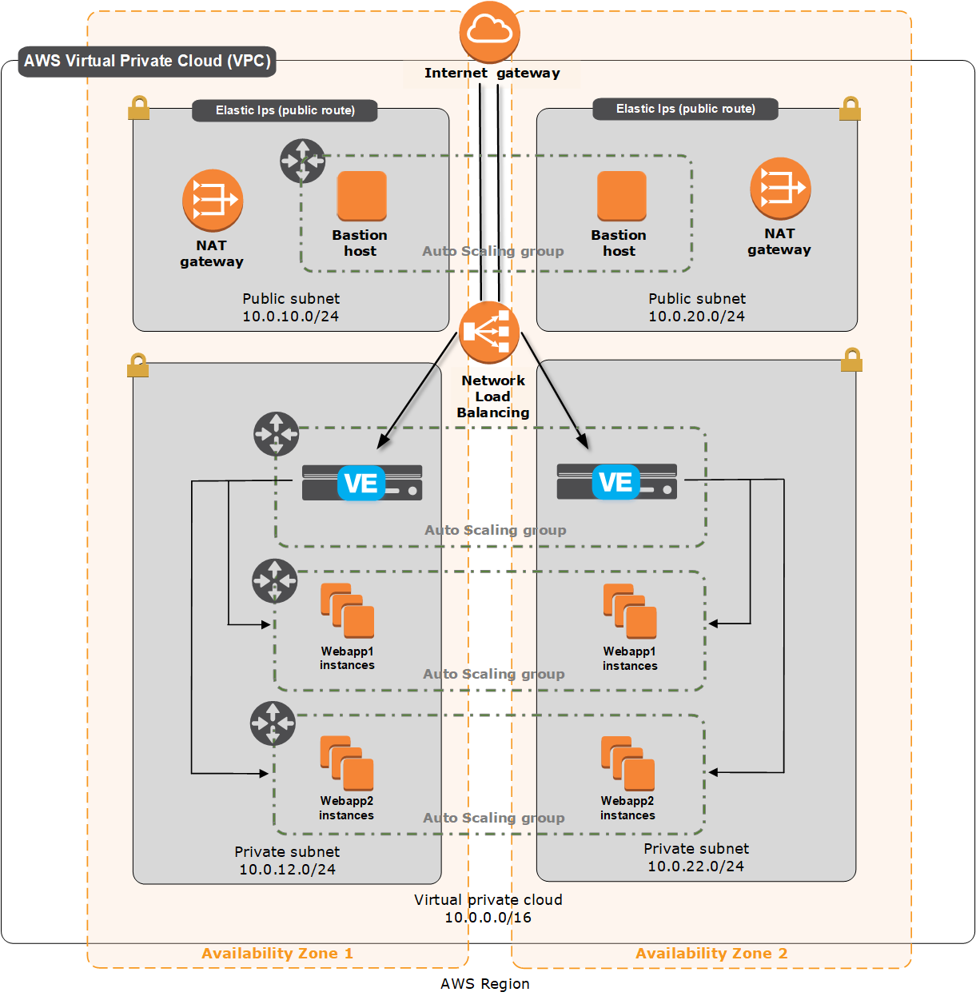

[](https://f5cloudsolutions.herokuapp.com)
[](https://github.com/f5networks/f5-aws-cloudformation/releases)
[](https://github.com/f5networks/f5-aws-cloudformation/issues)

# AWS Quickstart
The quickstart template allows you to quickly launch an auto scale group of BIG-IP VEs into AWS to demonstrate a typical micro services use case and/or Blue and Green deployment strategy.

## Instructions:

This quickstart template deploys a full demo application stack, including the Network, a Bastion Host, and an auto scale group of BIG-IP VEs in front of two application Auto Scale Groups. 



The BIG-IP VEs provide advanced application services, such as Web Application Firewall (WAF), SSL termination/inspection, URI routing and service discovery. The virtual service on BIG-IP is configured via its declarative API named [Application Services Extension](https://clouddocs.f5.com/products/extensions/f5-appsvcs-extension/latest/).

### Prerequisites
The following are prerequisites for this solution:

 - The appropriate permission in AWS to launch CloudFormation (CFT) templates. You must be using an IAM user with the AdministratorAccess policy attached and have permission to create Auto Scale Groups, S3 Buckets, Cloudwatch Alarms, SNS Topics, SQS Queues, Lambda functions and IAM roles. For details on permissions and all AWS configuration, see https://aws.amazon.com/documentation/. 
 - Key pair for management access to BIG-IP VE (you can create or import the key pair in AWS), see https://docs.aws.amazon.com/AWSEC2/latest/UserGuide/ec2-key-pairs.html for information.
 - Accepted the EULA for the F5 image in the AWS marketplace. If you have not deployed BIG-IP VE in your environment before, search for F5 in the Marketplace and then click **Accept Software Terms**.  This only appears the first time you attempt to launch an F5 image. By default, this solution deploys the F5 BIG-IP LTM Best 25Mbps and WAF Best 25Mpbs images. For information, see [K14810: Overview of BIG-IP VE license and throughput limits](https://support.f5.com/csp/article/K14810).


In addition to standard requirements for the BIG-IP deployment you also need permission to: 

- Create an AWS Network Load Balancer 
- Accept the EULA for the example web server image [Ubuntu 18.04 Bionic](https://aws.amazon.com/marketplace/pp/B07CQ33QKV)


### Deploying the master template using the AWS Launch Stack button
The easiest way to deploy this CloudFormation template is to use the Launch Stack button.<br>
**Important**: You may have to select the AWS region in which you want to deploy after clicking the Launch Stack button.


Complete the template as applicable for your configuration.  You can leave all the default values, but you must specify the following required parameters: 
  1. Availability Zones
  2. Key Pair Name
  3. Notification Email
  

Once deployed *(takes approximately 30 Minutes)* and the master.template reports **COMPLETE**, navigate to master template **Outputs** tab and find the output for **appUrl**.  Click or copy the URL in browser. For example: https://example.com


<a href="https://console.aws.amazon.com/cloudformation/home?region=us-east-1#/stacks/new?stackName=quickstart-stack&templateURL=https://f5-cft.s3.amazonaws.com/quickstarts/v0.0.0.3/templates/f5/master.template">
    </a>

### To test the WAF
Use the following command to test the F5 Web Application Firewall (WAF):  

`curl -sk -H "Content-Type: application/json; ls /usr/bin" https://example.com`

This command reprsents an example of linux command injection into curl command and therefore, it should be prevented/blocked by WAF service


### To test the Application

The virtual service is using a self-signed certificate, so click through any browser warnings (see your browser documentation for details). You will land on the home page, which points at the pool for the first Auto scale Group (blue). Click the API tab, and you are routed via the URI routing policy to the pool for the second Auto Scale Group (green).


#### To Explore to BIG-IP itself via Bastion Host

1. Obtain BASTION-HOST's PUBLIC IP address
    - You can first find the output in the master template for *bastionAutoscaleGroup*, for example:  
        `quickstart-BastionStack-12D20R0QMSN1K-bastionAutoscaleGroup-1RYMR17LSMLUI`
    - Go to EC2 Console **Auto Scaling Groups** Page and search for the bastion autoscale group. 
    - Click the Auto Scale Group's **Instances** tab and then click the instance OR go through ECE **Instances** tab directly.
    - Find an instance named  **Bastion Host Instance: quickstart**.
    - Locate the **IPv4 Public IP** in the **Description** Tab.

2. Obtain the BIG-IP VE PRIVATE IP address 
    - Go to the master template's **Output** tab and find the output for **bigipAutoscaleGroup**, for example: `quickstart-BIGIPStack-49SKKJZM53FM-bigipAutoscaleGroup-FIIMUG9KXYEC`
    - Go to the EC2 Console's **Auto Scale Groups** Tab and search for that Auto Scale Group. 
    - Go to that Auto Scale Group's **Instances** Tab, and then click the instance (or instance with *Scale-In protection enabled*) if more instances were launched. 
    - Note the IP address in the **Private IPs** field in the **Description** Tab.


To Log into the CLI:

From your desktop client/shell, create an SSH tunnel:

`ssh -i [keyname-passed-to-template.pem] -o ProxyCommand='ssh -i [keyname-passed-to-template.pem] -W %h:%p ubuntu@[BASTION-HOST-PUBLIC-IP]' admin@[BIG-IP-HOST-PRIVATE-IP]`

Replace the variables in brackets before submitting the command.

For example:

`ssh -i mykey.pem -o ProxyCommand='ssh -i ~/.ssh/mykey.pem -W %h:%p ubuntu@34.221.147.237' admin@172.16.11.112`

To Log in the BIG-IP Configuration utility (GUI):

`ssh -i [keyname-passed-to-template.pem] ubuntu@[BASTION-HOST-PUBLIC-IP] -L 8443:[BIG-IP-HOST-PRIVATE-IP]:8443`

You should now be able to open a browser to the BIG-IP UI from your desktop:

https://localhost:8443

Click through the Self-Signed Certificate warning and log in with: 

username: **quickstart**

password: **[instance-id]** *(use the instance-id of the first instance launched, i.e. instance with Scale-In protection enabled)*


#### EVALUATE THE URI ROUTING POLICY

In the AppUrl, click the **API** tab. Notice it turns green. Requests are being directed to a second pool (in this case it is the green pool but in practice, it would be another service).  You can see this via inspecting statistics:

From the CLI: 

```
admin@(ip-10-0-11-112)(cfg-sync In Sync)(Active)(/Common)(tmos)# cd /tenant/https
admin@(ip-10-0-11-112)(cfg-sync In Sync)(Active)(/tenant/https_virtual)(tmos)# show ltm pool
```

From the BIG-IP Configuration utility:

Click **Local Traffic > Pools** 

*Important:*  Go to upper right corner of BIG-IP UI, and from the **Partition** list, select **tenant**

Click **Statistics** on the menu bar.


You can also inspect the URI Policy Rules executing:

From the CLI:

`admin@(ip-10-0-11-112)(cfg-sync In Sync)(Active)(/tenant/https)(tmos)# show ltm policy forward_policy_green`

From the BIG-IP Configuration utility:

CLick **Local Traffic -> Policies -> Statistics**

On the *forward-policy* object, and in the Details column, click the **View** link.


#### EVALUATE BLUE GREEN

You can test manually updating a pool to look for a different tag by updating the Application Service. This requires access to the API port (8443) on the BIG-IP:

From a bash shell (either the bastion host or BIG-IP VE's (assuming you have access via tunnel above)):

`admin@(ip-10-0-11-112)(cfg-sync In Sync)(Active)(/tenant/https)(tmos)# bash`

After replacing the variables to match your deployment, you can copy/paste the following directly:


```
bigip_username=quickstart
bigip_password=i-0f520d309010d4bd5
bigip_host=10.0.11.112  #(or localhost if using tunnel)
bigip_port=8443

# GET
curl -sk -u ${bigip_username}:${bigip_password} -H "Content-type: application/json" https://localhost:8443/mgmt/shared/appsvcs/declare | python -m json.tool > virtual_service_defintion.json
```

Edit **virtual_service_definition.json** to change the values for tagValue fields:
```
   "tagKey": "f5demoapp",
   "tagValue": "f5-demo-app-1.0.1",
```
For example, from 

**"f5-demo-app-1.0.1"** to  **"f5-demo-app-1.0.2"**

and

**"f5-demo-app-1.0.2"** to  **"f5-demo-app-1.0.3"**  *(non-existent)*

So that default pool (pool_blue) is now pointing at the green Auto Scale Group (with the tag "f5demoapp: f5-demo-app-1.0.2"). 

Update the Virtual Service:
```
# POST
curl -sk -u ${bigip_username}:${bigip_password} -H "Content-type: application/json"  -sk  -X POST -d @virtual_service_defintion.json https://${bigip_host}:${bigip_port}/mgmt/shared/appsvcs/declare | python -m json.tool
```

Review the output to confirm the values have changed.  

Now you can go back to your appURL and notice default home page is going to 2nd pool (green).

### Troubleshooting 

The [troubleshooting steps](./troubleshooting-steps.md) page provides a list of most common problems with AWS CloudFormation deployments and their resolutions

#### More Information

For more information, see:

BIG-IP in AWS:
https://clouddocs.f5.com/cloud/public/v1/aws_index.html
https://github.com/f5networks/f5-aws-cloudformation

Application Services 3 Extension (AS3)
https://clouddocs.f5.com/products/extensions/f5-appsvcs-extension/latest/