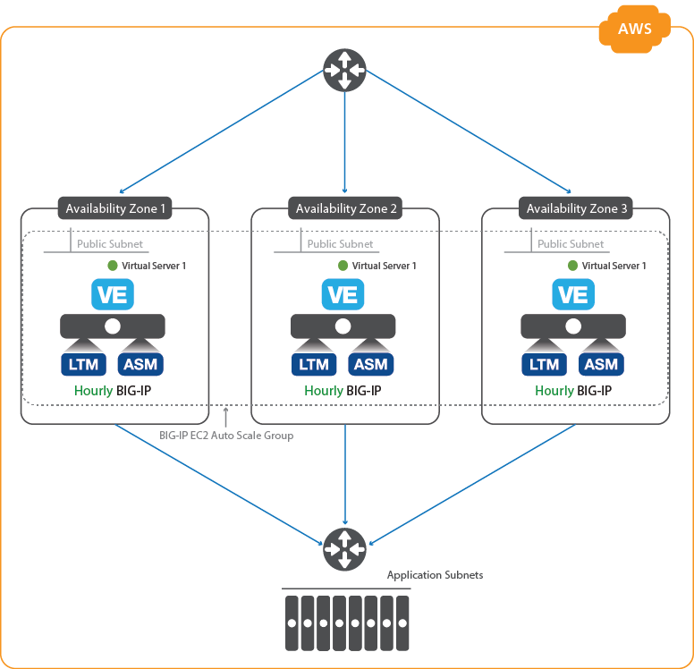

# Auto Scaling BIG-IP VE Web Application Firewall (WAF) in AWS

## Introduction
Secure your applications by using this auto scaling deployment of BIG-IP Virtual Edition (VE) Web Application Firewall (WAF) in Amazon Web Services. Advanced traffic management and web application security functionality is provided by the <a href="https://f5.com/products/big-ip/local-traffic-manager-ltm">Local Traffic Manager</a> (LTM) and <a href="https://f5.com/products/big-ip/application-security-manager-asm">Application Security Manager</a> (ASM) modules in BIG-IP VE. As traffic increases or decreases, the number of BIG-IP VE WAF instances automatically increases or decreases accordingly. 

For more details, see [Deployment details](#config).

## Prerequisites
Before you deploy this solution from the AWS Marketplace, you need these prerequisites:
 - A [secure, accurate, and up-to-date template](/docs/security.md).
 - The appropriate [AWS permissions](/docs/perms.md). 
 - An AWS VPC with a public subnet.
 - A DNS name for the application pool; either a server or the ELB behind BIG-IP VE.
 - A classic [Elastic load balancer (ELB)](/docs/ELB_details.md) in front of the BIG-IP VE. It must be pre-configured to perform SSL offload.
 - A key pair for SSH access to BIG-IP VE (you can create or import the key pair in AWS).
 - An AWS Security Group with the following inbound rules:
    - Port 22 for SSH access to BIG-IP VE *(source = Intra-VPC and/or mgmt networks)*
    - Port 8443 (or other port) for the BIG-IP web-based Configuration utility *(source = Intra-VPC and/or mgmt networks)*.
    - Port 4353 and 6123-6128 for cluster communication *(source = Intra-VPC or the public subnet of the peer)* 
    - Port 80 for accessing your applications via the BIG-IP virtual server *(source = any)*
 - Access to **Best** BIG-IP images in the Amazon region within which you are working.
 - Accept the EULA for all images in the AWS Marketplace. If you have not deployed BIG-IP VE in your environment before, search for F5 in the Marketplace and accept the EULA there.
 
## How to deploy the template 
This readme file describes how to launch the CFT from the AWS Marketplace. If you are using another method, see https://github.com/F5Networks/f5-aws-cloudformation/tree/master/supported/solutions/autoscale.

From the Marketplace: 
- From the **For Region** list, select your Region.
- From the **Delivery Methods** list, select **Auto Scale Cluster Deployment using AWS CFT**.
- Click **Continue**.
- Launch the CloudFormation template.
- When BIG-IP VE has initialized successfully, [log in](/docs/login.md).

### Template Parameters ###
The template contains the following parameters.  

| Parameter | Required | Description |
| --- | --- | --- |
| deploymentName | x | Name the template uses to create BIG-IP and AWS object names |
| vpc | x | AWS VPC where you want to deploy the BIG-IP VEs |
| availabilityZones | x | Availability Zones where you want to deploy the BIG-IP VEs (we recommend at least 2) |
| subnets | x | Public or External Subnet for the Availability Zones |
| bigipSecurityGroup | x | AWS Security Group for the BIG-IP VEs |
| bigipElasticLoadBalancer | x | AWS Elastic Load Balancer group for the BIG-IP VEs |
| sshKey | x | EC2 KeyPair to enable SSH access to the BIG-IP instance |
| instanceType | x | AWS Instance Type (the default is m3.2xlarge) |
| throughput | x | Maximum amount of throughput for the BIG-IP VEs (the default is 1000Mbps) |
| adminUsername | x | BIG-IP Admin Username for clustering. Note that the user name can contain only alphanumeric characters, periods ( . ), underscores ( _ ), or hyphens ( - ). Note also that the user name cannot be any of the following: adm, apache, bin, daemon, guest, lp, mail, manager, mysql, named, nobody, ntp, operator, partition, password, pcap, postfix, radvd, root, rpc, rpm, sshd, syscheck, tomcat, uucp, or vcsa. |
| managementGuiPort | x | Port of BIG-IP management Configuration utility (the default is 8443) |
| timezone | x | Olson timezone string from /usr/share/zoneinfo (the default is UTC) |
| ntpServer | x | NTP server for this implementation (Default 0.pool.ntp.org) |
| scalingMinSize | x | Minimum number of BIG-IP instances (1-8) to be available in the Auto Scaling Group (the default is 1) |
| scalingMaxSize | x | Maximum number of BIG-IP instances (2-8) that can be created in the Auto Scaling Group (the default is 3) |
| scaleDownBytesThreshold | x | Incoming Bytes Threshold to begin scaling down BIG-IP Instances (the default is 10000)1 |
| scaleUpBytesThreshold | x | Incoming Bytes Threshold to begin scaling up BIG-IP Instances (the default is 35000)1 |
| notificationEmail |  | Valid email address to send Auto Scaling Event Notifications |
| virtualServicePort | x | Port on BIG-IP (the default is 80) |
| applicationPort | x | Application Pool Member Port on BIG-IP (the default is 80) |
| appInternalDnsName | x | DNS name for the application pool |
| [policyLevel](/docs/blocking_levels.md) | x | WAF Policy Level to protect the application (the default is high); for details, see [Security blocking levels](/docs/blocking_levels.md) |
| application |  | Application Tag (the default is f5app) |
| environment |  | Environment Name Tag (the default is f5env) |
| group |  | Group Tag (the default is f5group) |
| owner |  | Owner Tag (the default is f5owner) |
| costcenter |  | Cost Center Tag (the default is f5costcenter) |
 
1 Scaling Up/Down Thresholds:
The default values are set artificially low for testing. We recommend adjusting as a ratio to utility size (optional).
For example, 80% of Throughput:

Scale Up Bytes Threshold =  
25 Mbps   = 3276800 bytes   * .80 =   2621440 
200 Mbps  = 26214400 bytes  * .80 =  20971520 
1000 Mbps = 131072000 bytes * .80 = 104857600 
5000 Mbps = 655360000 bytes * .80 = 524288000
 

## Deployment details  ##

The following diagram shows a simple deployment of this solution. 

### In BIG-IP VE: ###

In this solution, a clustered set of BIG-IP VEs are created. 

The LTM and ASM modules, which are part of a licensed **Best 1000Mbps** image, are provisioned on each BIG-IP VE, and provide advanced traffic management and security functionality.

The BIG-IP VEs are configured by using an [iApp](https://devcentral.f5.com/iapps) that includes a basic virtual service (listening on 0.0.0.0:80) with a WAF policy. 

Each BIG-IP VE instance has a single network interface (NIC) attached to a public subnet. This single interface processes both management and data plane traffic. 

When the first instance of BIG-IP VE launches, a device group called "autoscale-group" is automatically created. This instance is registered as the primary instance and it remains in the device group, even while other instances are launched/added to the cluster and terminated/removed from the cluster. 

After the first instance is launched, you can [log in to this instance](/docs/login.md) and customize its configuration. While you can technically make changes to any BIG-IP VE in the cluster, for consistency you should only make changes to the original, primary instance.

Cluster membership is updated every 10 minutes and metrics are sent (where?) every 60 seconds using [iCall](https://devcentral.f5.com/icall).

Automatic sync is enabled for the device group, so configuration changes are immediately propagated to all BIG-IP VEs in the cluster. All instances are "Active" and actively process traffic. 

### In AWS: ###

In AWS, an Auto Scaling Group of BIG-IP VEs is created. Each instance's parameters and configuration is defined by the Auto Scaling group's *launch configuration*. The launch configuration is used to:

  - Set the BIG-IP system information: hostname, NTP, DNS settings, and so on.
  - Provision the WAF module: BIG-IP Application Security Manager (ASM)
  - Join the BIG-IP VE cluster
  - Deploy integration with EC2 Auto Scaling and CloudWatch services for scaling of the BIG-IP tier.
  - Create an initial HTTP virtual server with a basic Web Application Firewall policy ([Low, Medium, High](/docs/blocking_levels.md)).
  
## After you deploy ##

- If you need to upgrade or change the deployment, you can [update the stack](/docs/updating.md).

- If you want to remove the deployment altogether, [you can](/docs/removing.md).

### Help ###
Because this template has been created and fully tested by F5 Networks, it is supported by F5. This means you can get assistance if necessary from F5 Technical Support.

We encourage you to use our [Slack channel](https://f5cloudsolutions.herokuapp.com) for discussion and assistance on F5 CloudFormation templates.  This channel is typically monitored Monday-Friday 9-5 PST by F5 employees who will offer best-effort support. 

### File an Issue ###
If you find an issue, we would love to hear about it. 
You have a choice when it comes to filing issues:
  - For enhancements, feature requests, and non-urgent bug fixes: On the GitHub menu bar in this repository, use the **Issues** link. Tell us as much as you can about what you found and how you found it.
  - For more time sensitive changes and other issues requiring immediate support: Use your typical method for contacting F5 Technical support.
  
## Copyright

Copyright 2014-2017 F5 Networks Inc.

## License

Apache V2.0
~~~~~~~~~~~
Licensed under the Apache License, Version 2.0 (the "License"); you may not use
this file except in compliance with the License. You may obtain a copy of the
License at

http://www.apache.org/licenses/LICENSE-2.0

Unless required by applicable law or agreed to in writing, software
distributed under the License is distributed on an "AS IS" BASIS,
WITHOUT WARRANTIES OR CONDITIONS OF ANY KIND, either express or implied.
See the License for the specific language governing permissions and limitations
under the License.

Contributor License Agreement
~~~~~~~~~~~~~~~~~~~~~~~~~~~~~
Individuals or business entities who contribute to this project must have
completed and submitted the `F5 Contributor License Agreement`
