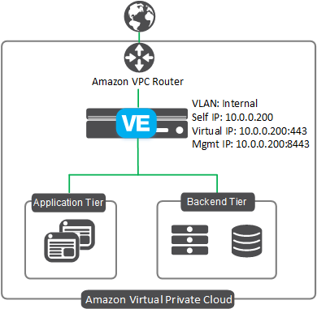

# Deploying the BIG-IP in AWS - Single NIC

[](https://f5cloudsolutions.herokuapp.com)

## Introduction
This solution uses a CloudFormation Template to launch a single NIC deployment a BIG-IP VE in an Amazon Virtual Private Cloud. Traffic flows from the BIG-IP VE to the application servers.  This is the standard Cloud design where the compute instance of
F5 is running with a single interface, which processes both management and data plane traffic.  This is a traditional model in the cloud where the deployment is considered one-armed.
 
The **existing stack** CloudFormation template incorporates an existing Virtual Private Cloud (VPC). If you would like to run a *full stack* which creates and configures the BIG-IP, the AWS infrastructure, as well as a backend webserver, see the templates located in the *learning-stacks* folder in the **experimental** directory.

See the **[Configuration Example](#config)** section for a configuration diagram and more information for this solution.

## Prerequisites
The following are prerequisites for the F5 single NIC CFT:
  - An AWS VPC with one subnet
  - Key pair for SSH access to BIG-IP VE (you can create or import in AWS)
  - An AWS Security Group with the following inbound rules:
    - Port 22 for SSH access to the BIG-IP VE
    - Port 8443 (or other port) for accessing the BIG-IP web-based Configuration utility
    - A port for accessing your applications via the BIG-IP virtual server
  
## Security
This CloudFormation template downloads helper code to configure the BIG-IP system. If your organization is security conscious and you want to verify the integrity of the template, you can open the CFT and ensure the following lines are present. See [Security Detail](#securitydetail) for the exact code in each of the following sections.
  - In the */config/verifyHash* section: **script-signature** and then a hashed signature
  - In the */config/installCloudLibs.sh* section **"tmsh load sys config merge file /config/verifyHash"**
  
## Supported instance types and hypervisors
  - For a list of supported AWS instance types for this solutions, see the **Amazon EC2 instances for BIG-IP VE** section of https://support.f5.com/kb/en-us/products/big-ip_ltm/manuals/product/bigip-ve-setup-amazon-ec2-12-1-0/1.html

  - For a list versions of the BIG-IP Virtual Edition (VE) and F5 licenses that are supported on specific hypervisors and AWS, see https://support.f5.com/kb/en-us/products/big-ip_ltm/manuals/product/ve-supported-hypervisor-matrix.html.

### Help
We encourage you to use our [Slack channel](https://f5cloudsolutions.herokuapp.com) for discussion and assistance on F5 CloudFormation templates.  This channel is typically monitored Monday-Friday 9-5 PST by F5 employees who will offer best-effort support.<br>
While this template has been created by F5 Networks, it is in the experimental directory and therefore has not completed full testing and is subject to change.  F5 Networks does not offer technical support for templates in the experimental directory. For supported templates, see the templates in the **supported** directory.


## Installation

There are two methods for deploying this template: 
  - Using the AWS deploy buttons 
  - Using [CLI Tools](#cli)

### Using the AWS deploy buttons
The easiest way to deploy one of the CloudFormation templates is to use the appropriate Launch button.
 - Hourly, which uses pay-as-you-go hourly billing
 - [BYOL](#byol) (bring your own license), which allows you to use an existing BIG-IP license.
<br><br>

**Hourly deploy button**

Use this button to deploy the **hourly** template: 

<a href="https://console.aws.amazon.com/cloudformation/home?region=us-east-1#/stacks/new?stackName=BigIp-1nic-Hourly&templateURL=https://s3.amazonaws.com/f5-cft/f5-existing-stack-hourly-1nic-bigip.template">
    
</a>
<br>
<br>

**Hourly Parameters**<br>
After clicking the Launch button, you must specify the following parameters.


| Parameter | Required | Description |
| --- | --- | --- |
| adminPassword | x | Type the BIG-IP admin password |
| adminUsername | x | Type the BIG_IP user name |
| bigipExternalSecurityGroup | x | Public or External Security Group ID |
| imageName | x | F5 BIG-IP Performance Type |
| instanceType | x | BIG-IP virtual instance type |
| managementGuiPort | x | Port to use for the management port GUI |
| restrictedSrcAddress | x | The IP address range that can be used to SSH to the EC2 instances |
| sshKey | x | Name of an existing EC2 KeyPair to enable SSH access to the instance |
| subnet1Az1 | x | Public or External subnet ID |
| Vpc | x | Common VPC for the deployment |

<br>
<a name="byol"></a>**BYOL deploy button**

Use this button to deploy the **BYOL** template: 

<a href="https://console.aws.amazon.com/cloudformation/home?region=us-east-1#/stacks/new?stackName=BigIp-1nic-BYOL&templateURL=https://s3.amazonaws.com/f5-cft/f5-existing-stack-byol-1nic-bigip.template">
    
</a>

<br>
<br>
**BYOL Parameters**<br>
After clicking the Launch button, you must specify the following parameters.

| Parameter | Required | Description |
| --- | --- | --- |
| adminPassword | x | Type the BIG-IP admin password |
| adminUsername | x | Type the BIG-IP user name |
| bigipExternalSecurityGroup | x | Public or External Security Group ID |
| imageName | x | F5 BIG-IP Performance Type |
| instanceType | x | BIG-IP virtual instance type |
| licenseKey1 | x | Type or paste your F5 BYOL regkey here |
| managementGuiPort | x | Port to use for the management port GUI |
| restrictedSrcAddress | x | The IP address range that can be used to SSH to the EC2 instances |
| sshKey | x | Name of an existing EC2 KeyPair to enable SSH access to the instance |
| subnet1Az1 | x | Public or External subnet ID |
| Vpc | x | Common VPC for the deployment |


### <a name="cli"></a>AWS CLI Usage
Coming soon

## Configuration Example <a name="config"></a>

The following is a simple configuration diagram for this single NIC deployment. In this scenario, all access to the BIG-IP VE appliance is through the same IP address and virtual network interface (vNIC).  This interface processes both management and data plane traffic.


### Documentation
The ***BIG-IP Virtual Edition and Amazon Web Services: Single NIC Setup*** guide (https://support.f5.com/kb/en-us/products/big-ip_ltm/manuals/product/bigip-ve-setup-amazon-ec2-12-1-0.html) details how to create the configuration manually without using the CloudFormation template.  This document also describes the configuration in more detail.


## Security Details <a name="securitydetail"></a>
This section has the entire code snippets for each of the lines you should ensure are present in your template file if you want to verify the integrity of the helper code in the template.

**/config/verifyHash section**

Note the hashed script-signature may be different in your template.<br>


```json
"/config/verifyHash": {
                "content": {
                  "Fn::Join": [
                    "\n",
                    [
                      "cli script /Common/verifyHash {",
                      "proc script::run {} {",
                      "    set file_path  [lindex $tmsh::argv 1]",
                      "    set expected_hash 73d01a6b4f27032fd31ea7eba55487430ed858feaabd949d4138094c26ce5521b4578c8fc0b20a87edc8cb0d9f28b32b803974ea52b10038f068e6a72fdb2bbd",
                      "    set computed_hash [lindex [exec /usr/bin/openssl dgst -r -sha512 $file_path] 0]",
                      "    if { $expected_hash eq $computed_hash } {",
                      "        exit 0",
                      "    }",
                      "    exit 1",
                      "}",
                      "    script-signature OGvFJVFxyBm/YlpBsOf8/AIyo5+p7luzrE11v8t7wJ1u24MBeit5pL/McqLxjydPJplymTcJ0qDEtXPZv09TTUF5hrF0g1pJ+z70omzJ6J9kOfOO8lyWP4XU/qM+ywEgAGoc8o8kGjKX01XcmB1e3rq6Mj5gE7CEkxKEcNzF3n5nDIFyBbpG6pJ8kg/7f6gtU14bJo0+ipNAiX+gBmT/10aUKKeJESU5wz+QqnEOE1WuTzdURArxditpk0+qqROZaSULD61w72hEy7kBC/miO+As7q8wjM5/H2yUHLoFLmBWP0jMWqIuzqnG+tgAFjJbZ1UJJDzWiYZK1TG1MsxfPg==",
                      "}"
                    ]
                  ]
                },
                "mode": "000755",
                "owner": "root",
                "group": "root"
              }
```
<br><br>
**/config/installCloudLibs.sh section**


```json
"/config/installCloudLibs.sh": {
                "content": {
                  "Fn::Join": [
                    "\n",
                    [
                      "#!/bin/bash",
                      "echo about to execute",
                      "checks=0",
                      "while [ $checks -lt 120 ]; do echo checking mcpd",
                      "    tmsh -a show sys mcp-state field-fmt | grep -q running",
                      "    if [ $? == 0 ]; then",
                      "        echo mcpd ready",
                      "        break",
                      "    fi",
                      "    echo mcpd not ready yet",
                      "    let checks=checks+1",
                      "    sleep 10",
                      "done",
                      "echo loading verifyHash script",
                      "tmsh load sys config merge file /config/verifyHash",
                      "if [ $? != 0 ]; then",
                      "    echo cannot validate signature of /config/verifyHash",
                      "    exit",
                      "fi",
                      "echo loaded verifyHash",
                      "echo verifying f5-cloud-libs.targ.gz",
                      "tmsh run cli script verifyHash /config/cloud/f5-cloud-libs.tar.gz",
                      "if [ $? != 0 ]; then",
                      "    echo f5-cloud-libs.tar.gz is not valid",
                      "    exit",
                      "fi",
                      "echo verified f5-cloud-libs.tar.gz",
                      "echo expanding f5-cloud-libs.tar.gz",
                      "tar xvfz /config/cloud/f5-aws-autoscale-cluster.tar.gz -C /config/cloud",
                      "tar xvfz /config/cloud/asm-policy-linux.tar.gz -C /config/cloud",
                      "tar xvfz /config/cloud/f5-cloud-libs.tar.gz -C /config/cloud/aws/node_modules",
                      "cd /config/cloud/aws/node_modules/f5-cloud-libs",
                      "echo installing dependencies",
                      "npm install --production /config/cloud/f5-cloud-libs-aws.tar.gz",
                      "touch /config/cloud/cloudLibsReady"
                    ]
                  ]
                },
                "mode": "000755",
                "owner": "root",
                "group": "root"
              }
```


## Design Patterns


The goal is for the design patterns for all the iterative examples of F5 being deployed via CloudFormation templates to closely match as much as possible.

### List of Patterns For Contributing Developers


 1. Still working on patterns to use

## Filing Issues

See the Issues section of `Contributing <CONTRIBUTING.md>`__.

## Contributing

See `Contributing <CONTRIBUTING.md>`__

## Test


Before you open a pull request, your code must have passed a deployment into Azure with the intended result


## Copyright

Copyright 2014-2016 F5 Networks Inc.


## License


Apache V2.0
~~~~~~~~~~~
Licensed under the Apache License, Version 2.0 (the "License"); you may not use
this file except in compliance with the License. You may obtain a copy of the
License at

http://www.apache.org/licenses/LICENSE-2.0

Unless required by applicable law or agreed to in writing, software
distributed under the License is distributed on an "AS IS" BASIS,
WITHOUT WARRANTIES OR CONDITIONS OF ANY KIND, either express or implied.
See the License for the specific language governing permissions and limitations
under the License.

Contributor License Agreement
~~~~~~~~~~~~~~~~~~~~~~~~~~~~~
Individuals or business entities who contribute to this project must have
completed and submitted the `F5 Contributor License Agreement`
