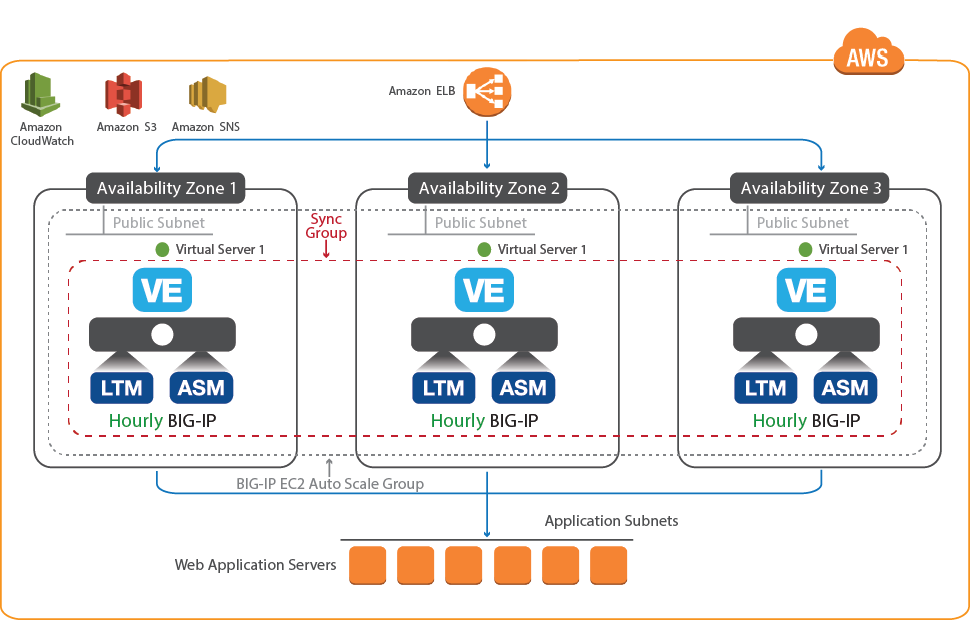

# Auto scaling the BIG-IP VE Web Application Firewall in AWS: Existing Stack with PAYG Licensing (Frontend via ELB)
[](https://f5cloudsolutions.herokuapp.com)
[](https://github.com/f5networks/f5-aws-cloudformation/releases)
[](https://github.com/f5networks/f5-aws-cloudformation/issues)

**Contents**             

 - [Introduction](#introduction) 
 - [Prerequisites](#prerequisites)
 - [Important Configuration Notes](#important-configuration-notes)
 - [Launching the template using the AWS Launch Stack buttons](#launching-the-template-using-the-aws-launch-stack-buttons) 
 - [Getting Help](#getting-help)
 - [Additional BIG-IP VE Deployment and Configuration Details](#additional-big-ip-ve-deployment-and-configuration-details)
 - [Security](#security)


## Introduction
This solution implements auto scaling of BIG-IP Virtual Edition (VE) Web Application Firewall (WAF) systems in Amazon Web Services, using PAYG (pay as you go) hourly licensing. 

This is an *existing stack* template, meaning the networking infrastructure MUST be available prior to deploying. See the Template Parameters Section for required networking objects.

Auto scaling means that as traffic through the BIG-IP VE or the BIG-IP CPU utilization increases or decreases, the number of BIG-IP VE WAF instances automatically increases or decreases accordingly (based on values you enter in the template). The BIG-IP VEs have the <a href="https://f5.com/products/big-ip/local-traffic-manager-ltm">Local Traffic Manager</a> (LTM) and <a href="https://f5.com/products/big-ip/application-security-manager-asm">Application Security Manager</a> (ASM) modules enabled to provide advanced traffic management and web application security functionality. 

This template autoscales using BIG-IP VE Pay As You Go (PAYG) instances.

See our [video on YouTube](https://www.youtube.com/watch?v=TGHi_KbZ0t4) to see a similar template in action. For information on getting started using F5's CFT templates on GitHub, see [Amazon Web Services: Solutions 101](http://clouddocs.f5.com/cloud/public/v1/aws/AWS_solutions101.html).


## Prerequisites
The following are prerequisites and notes for this solution:
 - The appropriate permission in AWS to launch CloudFormation (CFT) templates. You must be using an IAM user with the AdministratorAccess policy attached and have permission to create Auto Scale Groups, S3 Buckets, Instances, and IAM Instance Profiles. For details on permissions and all AWS configuration, see https://aws.amazon.com/documentation/.
 - An existing AWS VPC with a public subnet, a classic Elastic load balancer (ELB) in front of the BIG-IP VE(s), and a DNS name for the application pool (which can be also be the DNS name of an ELB if using one behind the BIG-IP(s)). 
   - The classic ELB in front of the BIG-IP VEs must be preconfigured to perform SSL offload for the BIG-IP WAF auto scale tier. See [ELB configuration](#elb) for an example of the ELB configuration.
   - The subnet for the management network requires a route and access to the Internet for the initial configuration to download the BIG-IP cloud library. 
 - Access to **Best** BIG-IP images in the Amazon region within which you are working.
 - Accepted the EULA for all Images in the AWS marketplace. If you have not deployed BIG-IP VE in your environment before, search for F5 in the Marketplace and then click **Accept Software Terms**. This only appears the first time you attempt to launch an F5 image. 
 - Key pair for management access to BIG-IP VE (you can create or import the key pair in AWS), see http://docs.aws.amazon.com/cli/latest/reference/iam/upload-server-certificate.html for information.

## Important configuration notes
 - There are new options for BIG-IP license bundles.
 - F5 has created a matrix located [here](https://github.com/F5Networks/f5-aws-cloudformation/blob/main/aws-bigip-version-matrix.md) that contains all of the tagged releases of the F5 Cloud Formation Templates (CFTs) for Amazon AWS, and the corresponding BIG-IP versions, license types, and throughput levels available for a specific tagged release. 
 - Beginning with release 6.0.0, the default PAYG images have been updated to "F5 BIG-IP BEST with IPI and Threat Campaigns". IMPORTANT: changing the image can affect re-deployments (see above). If you have an existing subscription and need to preserve the previous image ID/name, use the **customImageId** parameter, used for custom images (for example, clones or different versions from the marketplace). To see a list of available BIG-IP images and IDs from the marketplace (for example in "us-east-1"), you can run the AWS command below:
   ```
   $ aws ec2 describe-images --owners aws-marketplace --region us-east-1 --filters "Name=description,Values=F5*BIGIP**"  --query 'Images[*].[ImageId,Description,CreationDate]'
   ```
 - All supported versions of F5 CloudFormation templates include Application Services 3 Extension (AS3) on the BIG-IP VE. As of release 4.1.2, all supported templates give the option of including the URL of an AS3 declaration, which you can use to specify the BIG-IP configuration you want on your newly created BIG-IP VE(s). In templates such as autoscale, where an F5-recommended configuration is deployed by default, specifying an AS3 declaration URL will override the default configuration with your declaration. See the [AS3 documentation](https://clouddocs.f5.com/products/extensions/f5-appsvcs-extension/latest/) for details on how to use AS3.
 - This template uses [F5 BIG-IP Runtime Init](https://github.com/F5Networks/f5-bigip-runtime-init) to install F5 Automation Toolchain packages (AS3, DO, CFE, FAST, and TS). You can update the version of one or more packages by editing the UserData property of the BIG-IP instance resource(s). For example: To update the AS3 package to the latest version, click on the [Github release page](https://github.com/F5Networks/f5-appsvcs-extension/releases) for the f5-appsvcs-extension. In the instance UserData property, in the install_operations section, update the AS3 extensionVersion value to the desired version and the extensionHash value to contents of the RPM sha256 file located in the release assets for that version. You can also add more packages to be installed using the same procedure.
 - The **sa-east** region does not support using the **m4.xlarge** instance size. If you are using that region, you must select a different instance size. 
 - All of the BIG-IP VE members in the cluster are active and process traffic. See [Detailed Clustering Information](#detailed-clustering-information).
 - After deploying the template, if you need to change your BIG-IP VE password, there are a number of special characters that you should avoid using for F5 product user accounts. See https://support.f5.com/csp/article/K2873 for details.
 - After deploying the template, if you make manual changes to the BIG-IP configuration, you must see [this section](#important-if-you-make-manual-changes-to-big-ip-after-launching-the-template).
 - This template supports service discovery via the Application Services 3 Extension (AS3). See the [Service Discovery section](#service-discovery) for details.
 - This template supports telemetry streaming via the F5 Telemetry Streaming extension (TS). See [Telemetry Streaming](#telemetry-streaming) for details.
 - This template includes a master election feature, which ensures that if the existing master BIG-IP VE is unavailable, a new master is selected from the BIG-IP VEs in the cluster. As a part of this process, the template creates an IAM role-protected SQS queue (https://aws.amazon.com/sqs/) for communication between the BIG-IP VEs, and encrypted credentials are sent on this queue. Additionally, the template creates public keys for the BIG-IP VEs and puts them in an S3 bucket in the public_keys folder. See [How this solution works](#how-this-solution-works) for more details.
 - This template creates a user account named cluster-admin, which is used to join BIG-IP VE instances to the autoscale cluster. The password for this account is automatically generated and includes one special character; if using a custom password policy, the policy should require no more than one special character.
 - F5 AWS CFT templates now capture all deployment logs to the BIG-IP VE in **/var/log/cloud/aws**. Depending on which template you are using, this includes deployment logs (stdout/stderr), Cloud Libs execution logs, recurring solution logs (metrics, failover, and so on), and more.
 - This template can send non-identifiable statistical information to F5 Networks to help us improve our templates. See [Sending statistical information to F5](#sending-statistical-information-to-f5).

## Launching the template using the AWS Launch Stack buttons
The easiest way to deploy one of the CloudFormation templates is to use the appropriate Launch Stack button.<br>
**Important**: You may have to select the AWS region in which you want to deploy after clicking the Launch Stack button.

<a href="https://console.aws.amazon.com/cloudformation/home?region=us-east-1#/stacks/new?stackName=F5-PAYG-BIGIP-LTM-Autoscale&templateURL=https://f5-cft.s3.amazonaws.com/f5-payg-autoscale-bigip-waf.template"></a>


### Template Parameters ###
Once you have launched the CFT, you need to complete the template by entering the required parameter values. The following table can help you gather the information you need before beginning the template.


| CFT Label | Parameter Name | Required | Description |
| --- | --- | --- | --- |
| Deployment Name | deploymentName | Yes | Name the template uses to create BIG-IP and AWS object names |
| VPC ID | vpc | Yes | AWS VPC where you want to deploy the BIG-IP VEs |
| Availability Zone(s) | availabilityZones | Yes | Availability Zones where you want to deploy the BIG-IP VEs (we recommend at least 2) |
| Subnet ID(s) | subnets | Yes | Public or External Subnet for the Availability Zones |
| Restricted Source Addresses | restrictedSrcAddress | Yes | This field restricts management access to a specific network or address. Enter an IP address or address range in CIDR notation. Please do NOT use "0.0.0.0/0". Instead, restrict the IP address range to your client or trusted network, for example "55.55.55.55/32". Production should never expose the BIG-IP Management interface to the Internet. |
| Source Address(es) for Web Application Access (80/443) | restrictedSrcAddressApp | Yes | The IP address range that can be used for management access to the EC2 instances. |
| Elastic Load Balancer for BIG-IP VEs | bigipElasticLoadBalancer | Yes | Name of the AWS Elastic Load Balancer group for the BIG-IP VEs |
| SSH Key Name | sshKey | Yes | EC2 KeyPair to enable SSH access to the BIG-IP instance |
| AWS Instance Size | instanceType | Yes | AWS Instance Type (the default is m4.xlarge) |
| Maximum Throughput | throughput | Yes | The maximum amount of throughput for the BIG-IP VEs (the default is 1000Mbps) |
| Custom Image Id | customImageId | No | This parameter allows you to deploy using a custom BIG-IP image if necessary. If applicable, type the AMI Id in this field. **Note**: Unless specifically required, leave the default of **OPTIONAL**. |
| BIG-IP Admin User for clustering | adminUsername | Yes | BIG-IP Admin Username for clustering. Note that the user name can contain only alphanumeric characters, periods ( . ), underscores ( _ ), or hyphens ( - ). Note also that the user name cannot be any of the following: adm, apache, bin, daemon, guest, lp, mail, manager, mysql, named, nobody, ntp, operator, partition, password, pcap, postfix, radvd, root, rpc, rpm, sshd, syscheck, tomcat, uucp, or vcsa. |
| Management Port | managementGuiPort | Yes | Port of BIG-IP management Configuration utility (the default is 8443) |
| Timezone (Olson) | timezone | Yes | Enter the Olson timezone string from /usr/share/zoneinfo. The default is 'UTC'. See the TZ column here (https://en.wikipedia.org/wiki/List_of_tz_database_time_zones) for legal values. For example, 'US/Eastern'. |
| NTP Server | ntpServer | Yes | NTP server for this implementation (Default 0.pool.ntp.org) |
| BIG-IP Modules | bigIpModules | No | Comma separated list of modules and levels to provision, for example, 'ltm:nominal,asm:nominal' |
| Minimum Instances | scalingMinSize | Yes | Minimum number of BIG-IP instances (1-8) to be available in the Auto Scaling Group (we recommend starting with 1 and increasing to at least 2. This can be performed by [updating the stack](#restoring-or-upgrading-the-solution) |
| Maximum Instances | scalingMaxSize | Yes | Maximum number of BIG-IP instances (2-8) that can be created in the Auto Scale Group |
| Scale Down Bytes Threshold | scaleDownBytesThreshold | Yes | Incoming Bytes Threshold to begin scaling down BIG-IP Instances (the default is 10000)<sup>1</sup> |
| Scale Up Bytes Threshold | scaleUpBytesThreshold | Yes | Incoming Bytes Threshold to begin scaling up BIG-IP Instances (the default is 35000)<sup>1</sup> |
| Low CPU % Threshold | lowCpuThreshold | Yes | Low CPU % threshold to begin scaling up BIG-IP VE instances |
| High CPU % Threshold | highCpuThreshold | Yes | High CPU % threshold to begin scaling up BIG-IP VE instances |
| Notification Email | notificationEmail | Yes | Valid email address to send Auto Scaling Event Notifications |
| Virtual Service Port | virtualServicePort | Yes | Port on BIG-IP (the default is 80) |
| Application Pool Member Port | applicationPort | Yes | Application Pool Member Port on BIG-IP (the default is 80) |
| Application Pool DNS | appInternalDnsName | Yes | DNS name poolapp.example.com for the application pool. This is not required if you are using the [Service Discovery feature](#service-discovery). |
| Application Pool Tag Key | applicationPoolTagKey | No | This is used for the [Service Discovery feature](#service-discovery). If you specify a non-default value here, the template automatically discovers the pool members you have tagged with this key and the value you specify next. |
| Application Pool Tag Value | applicationPoolTagValue | No | This is used for the [Service Discovery feature](#service-discovery). If you specify a non-default value here, the template automatically discovers the pool members you have tagged with the key you specified and this value. |
| [Web Application Firewall Policy Level](#security-blocking-levels-) | policyLevel | Yes | WAF Policy Level to protect the application (the default is high) |
| Application | application | No | Application Tag (the default is f5app) |
| Environment | environment | No | Environment Name Tag (the default is f5env) |
| Group | group | No | Group Tag (the default is f5group) |
| Owner | owner | No | Owner Tag (the default is f5owner) |
| Cost Center | costcenter | No | Cost Center Tag (the default is f5costcenter) |

<br>


<sup>1</sup> Note about the Scaling Up/Down Thresholds:

The default template values are set artificially low for testing.<br>
The templates defaults are set to 80% and 20% respectively.<br> 
To adjust the thresholds, set them according to the utility size (optional).<br> 
For example, if you wanted use different percentages in the scaling threshold(s), modify the ***.80*** or ***.20*** in the following calculations to represent the percentage you want to use. Then take the result and use that as the appropriate threshold value in the CFT.

*Scale Up Bytes Thresholds:* <br>
25 Mbps   = 3276800 bytes   * ***.80*** =   2621440<br>
200 Mbps  = 26214400 bytes  * ***.80*** =  20971520<br>
1000 Mbps = 131072000 bytes * ***.80*** = 104857600<br>
 
*Scale Down Bytes Thresholds:*<br>
25 Mbps   = 3276800 bytes   * ***.20*** =   655360<br>
200 Mbps  = 26214400 bytes  * ***.20*** =  5242880<br>
1000 Mbps = 131072000 bytes * ***.20*** = 26214400<br>

---


### Logging into the BIG-IP device

Once you have completed the template and the BIG-IP system instantiates *(estimated at about 20 minutes)*, use the following guidance to access the BIG-IP VE.

  - Find the IP address of the BIG-IP VE<br> You can find the BIG-IP IP address (Instance IP or Public IP) on the Instances tab of the Auto Scale group created by the template (From the AWS console, click **EC2 > Auto Scaling > Auto Scaling Groups > Instances tab > Instance ID**)

  - SSH to the Instance or Public IP address using the following syntax:<br>``` >ssh -i ~/.ssh/<YOUR-PRIVATE-SSH-KEY-HERE> admin@<INSTANCE IP> ```
  - Create a custom-admin user using the following syntax:<br> ``` #tmsh create auth user my-custom-admin partition-access add { all-partitions { role admin } } prompt-for-password```
 
  - Once you have accessed the BIG-IP using SSH, you can log into the BIG-IP web-based Configuration utility using: **https://(IP Address of the instance):8443**. 

<a name="note"></a>
<br>
**Note**: If you want access to the BIG-IP web-based Configuration utility, you must first SSH into the BIG-IP VE using the SSH key you provided in the template as described in this section. You can then create a user account with admin-level permissions on the BIG-IP VE to allow access to the Configuration utility if necessary. In this deployment, the BIG-IP Configuration utility port is 8443 by default.


You can now configure the BIG-IP VE as applicable for your configuration. See the BIG-IP documentation for details (https://support.f5.com/csp/tech-documents)

<a name="manual"></a>
#### IMPORTANT: If you make manual changes to BIG-IP after launching the template

The template now automatically saves a BIG-IP back up UCS file (to the **/backup** directory in the S3 bucket created by the template) every night at 12am, and saves 7 days of back up UCS files. If you make manual changes to the configuration, we recommend immediately making a backup of your BIG-IP configuration manually and storing the resulting UCS file in the S3 bucket created by the template to ensure the master election process functions properly.
To manually save the BIG-IP configuration to a UCS file:

  1. Backup your BIG-IP configuration (ideally the cluster primary) by creating a [UCS](https://support.f5.com/csp/article/K13132) archive. Use the following syntax to save the backup UCS file:<br> ```# tmsh save /sys ucs /var/tmp/original.ucs```
  
  2. Store the UCS file in the S3 bucket created by the solution in folder called **/backup**.

---

## Service Discovery
This CloudFormation template now includes service discovery, which means the BIG-IP VE automatically updates pool members based on auto-scaled cloud application hosts. In the template, you enter information about your cloud environment, specifically the tag key and tag value for the pool members you want to include in service discovery, and then the BIG-IP VE programmatically discovers (or removes) members using those tags.

### Tagging
In AWS, you have two options for tagging objects that the service discovery feature uses. 
  - *Tag a VM resource*<br>
The BIG-IP VE will discover the primary public or private IP addresses for the primary NIC configured for the tagged VM.
  - *Tag a NIC resource*<br>
The BIG-IP VE will discover the primary public or private IP addresses for the tagged NIC. Use this option if you want to use the secondary NIC of a VM in the pool.


The template first looks for NIC resources with the tags you specify. If it finds NICs with the proper tags, it does not look for VM resources. If it does not find NIC resources, it looks for VM resources with the proper tags.

**Important**: Make sure the tags and IP addresses you use are unique. You should not tag multiple AWS nodes with the same key/tag combination if those nodes use the same IP address.

To use service discovery, in the **WAF Virtual Service Configuration** section of the template, in the **Application Pool Tag Key** and **Application Pool Tag Value** fields, enter your Key and Value information. If you leave these fields at the default, the template does not use service discovery, and uses the value you include for the Application Pool DNS. Note that if you enter both the Application Pool DNS value and the Key/Value information, the template only uses the Key/Value fields, which enables service discovery. 

---

## Tested BIG-IP versions
The following table lists the versions of BIG-IP that have been tested and validated against F5 AWS solution templates.

| BIG-IP Version | Build | Solution | Status | Notes |
| --- | --- | --- | --- | --- |
| 16.1.3.3 | 0.0.3 | Standalone, Failover, Autoscale | Validated | |
| 15.1.8.1 | 0.0.3 | Standalone, Failover, Autoscale | Validated | |
| 14.1.5.3 | 0.0.5 | Standalone, Failover, Autoscale | Validated | |
| 13.1.5.1 | 0.0.2 | Standalone, Failover, Autoscale | Not Validated | F5 CFE requires BIG-IP 14.1 or later |
| 12.1.6 | 0.0.9 | Standalone, Failover, Autoscale | Not Validated | F5 CFE requires BIG-IP 14.1 or later |

---

### Getting Help
**F5 Support**
Because this template has been created and fully tested by F5 Networks, it is fully supported by F5. This means you can get assistance if necessary from [F5 Technical Support](https://support.f5.com/csp/article/K25327565). You can modify the template itself if necessary, but if you modify any of the code ***outside*** of the lines ### START CUSTOM TMSH CONFIGURATION and ### END CUSTOM TMSH CONFIGURATION the template is no longer supported by F5.

---
---

## Additional BIG-IP VE deployment and configuration details 

All BIG-IP VE instances deploy with a single interface (NIC) attached to a public subnet. This single interface processes both management and data plane traffic. The LTM and ASM provide advanced traffic management and security functionality. The CloudFormation template collects some initial deployment input parameters and creates an auto scale group of BIG-IP VEs. The instances parameters and configurations are defined by the Auto Scale group's *launch configuration*. The launch configuration is used to:

  - Set the BIG-IP system information: hostname, NTP, DNS settings, and so on.
  - Provision the WAF module: BIG-IP Application Security Manager (ASM)
  - Join the auto scale cluster
  - Deploy integration with EC2 Auto Scale and CloudWatch services for scaling of the BIG-IP tier.
  - Create an initial HTTP virtual server with a basic Web Application Firewall policy (Low, Medium, High)
    - See the [Security Blocking Levels](##security-blocking-levels-) section for a description of the blocking levels for the Web Application Firewall presented in the template.

The CloudFormation template uses the default **Best** image available in the AWS marketplace to license these modules (you can choose 1000, 200, or 25 Mbps). Once the first instance is deployed, it becomes the cluster primary and all subsequent instances launched will join a cluster primary to pull the latest configuration from the cluster. In this respect, you can make changes to the running configuration of this cluster and not have to manage the lifecycle of the configuration strictly through the Launch Configuration.

#### Configuration Example <a name="config"></a>


The following is a simple configuration diagram deployment. 




#### Detailed clustering information
This solution creates a clustered system with "AutoSync" enabled, so any change is immediately propagated throughout the cluster. Each cluster member instance reports "Active" and "Actively" processes traffic. Although Autosync is enabled and technically you can make changes to any existing clustered member, for consistency we recommend you make any changes to the original, primary instance.

Note: There is no indication of the "primary" instance in the BIG-IP Configuration utility itself; this is simply an administrative designation in this deployment. To determine the primary instance, look for instance with *Scale-In Protection*. You can find the Scale-In Protection value in AWS by clicking **Auto Scaling Groups** > *Click your Auto Scale group* > **Instances Tab**, and then under the Protected From tab, look for the instance with **Scale-In**.

When the first auto scale instance is launched, a Device Group called "autoscale-group" is automatically created. 

Whenever a new instance is launched, it joins the cluster. If those instances are scaled down, they are removed from the cluster and the original instance remains. The cluster membership is updated once every 2 minutes and sends metrics every 60 seconds.

This deployment creates an initial BIG-IP configuration using an [iApp](https://community.f5.com/t5/technical-articles/understanding-iapps/ta-p/278430) that includes a basic virtual service (listening on 0.0.0.0:80) with a WAF policy.

After the first instance is launched, you can log in and customize the configuration (for example substitute a custom policy, add logging, and much more).

---

### How this solution works

The CloudFormation Template creates and leverages several AWS resources to support Auto Scale, including:

  - **S3 Bucket**<br>
    The S3 bucket acts as persistent storage for the cluster database. It contains:
      - *Records*<br>
      Records, named for the instance ID contain metadata for each instance. For example  ```{"privateIp":"10.0.11.190","mgmtIp":"10.0.11.190","hostname":"ip-10-0-11-190.ec2.internal","isMaster":true}```<br>
      Newly launched instances query this bucket for an existing cluster and use information found here to join the cluster. If it it the first member launched in the group, it creates a record with "isMaster":true. Otherwise, it enters itself as "isMaster":false.
      - *Public Keys*<br>
      Public keys for the BIG-IP VEs in the **public_keys** directory.
  - **IAM Role**<br>
  The IAM Role is used to create Instance Profile. The instance profile allows the auto scaled BIG-IP instances to access / update the S3 Bucket, query the Auto Scale Group, and upload metrics to Cloudwatch.
  
  - **SNS Topic**<br>
  The SNS topic is used to notify the admin via email of Scale Up / Down events.
  - **Cloudwatch Alarms**<br>
  These alarms are used to trigger scale Up / Down events.
  - **Auto Scale Group**<br>
  By default, the number of auto scaled instances is set to 1 and the maximum is set to 8. We recommend you launch the solution with 1 instance to start, and increasing this to at least two by [updating the stack](#restoring-or-upgrading-the-solution). 
  - **SQS Queue**<br>
  The SQS queue is used for cluster synchronization messages between cluster members.

  - **Primary Election Process**<br>
    In the event of a failure or scale-in event that deallocates the primary instance, a new primary instance is elected by the autoscale script based on the following criteria:
    - Last backup time: If only one device has a running configuration, that device is promoted to primary. This is determined based on the lastBackup timestamp, which is set to the beginning of epoch time by default; this date gets updated with sync cluster creation.
    - Lowest management IP address (private): If ***both*** devices have lastBackup set to either a) the default value or b) a non-default value, the device with the lowest private management IP address will be promoted to primary.
  - **Restore From UCS**<br>
    The template now automatically saves a BIG-IP back up UCS file (to the **/backup** directory in the S3 bucket created by the template) every night at 12am, and saves 7 days of back up UCS files. In the event the system needs to restore from a backup UCS file, the UCS with the latest timestamp will be restored when the following conditions are met:
    - No device present has a running configuration. Any device with a running configuration will be promoted to primary before UCS will be restored.
  - **Autoscale Timing**<br>
    This section describes the different autoscale timing intervals and how to override them.
    - Autoscale script execution interval: This interval can be overridden by changing the crontab schedule.
      - AWS default: 60 seconds. 
        - Usage example (from [AWS Autoscale template](https://github.com/F5Networks/f5-aws-cloudformation/blob/main/supported/autoscale/ltm/via-lb/1nic/existing-stack/payg/f5-payg-autoscale-bigip-ltm.template)): ("(crontab -l 2>/dev/null; echo '*/1 * * * * /config/cloud/aws/run_autoscale_update.sh') | crontab -\n",)
    - Primary instance expiration timeout default: 3 minutes. Expiration of this interval causes the re-election of a new primary device, and can be overridden by passing the following parameter to autoscale.js:
      - --primary-disconnected-time (milliseconds)
      - Usage example: **f5-rest-node /config/cloud/aws/node_modules/@f5devcentral/f5-cloud-libs/scripts/autoscale.js --cloud aws --primary-disconnected-time 90000**. See [f5-cloud-libs usage](https://github.com/F5Networks/f5-cloud-libs/blob/master/USAGE.md) for complete usage information.
    - Autoscale script execution timeout default: 10 minutes. Expiration of this interval causes the autoscale script execution to terminate, and can be overridden by passing the following parameter to autoscale.js:
      - --autoscale-timeout (minutes)
      - Usage example: **f5-rest-node /config/cloud/aws/node_modules/@f5devcentral/f5-cloud-libs/scripts/autoscale.js --cloud aws --autoscale-timeout 5**. See [f5-cloud-libs usage](https://github.com/F5Networks/f5-cloud-libs/blob/master/USAGE.md) for complete usage information.

---

### Restoring or upgrading the solution
Certain elements of this deployment can be updated with the CloudFormation stack itself. This is referred to as *Updating the Stack*. For instance, anything that causes the Auto Scale Launch Configuration to update, like changing the AMI IDs (to upgrade from one BIG-IP version to another), instance sizes, scaling thresholds, and many others, requires updating the stack. [This video](https://www.youtube.com/watch?v=nKxF6thckNQ) shows how to perform the following procedure.
 
Clustering is only done within a Launch Configuration ID basis, so any changes that result in a new Launch Configuration ID require the following procedure.

**Note**: Because the template now automatically saves a BIG-IP back up UCS file every night at 12am and saves 7 days of back up UCS files, steps 1 and 2 are not necessary unless you have made recent changes.
 
  1. Backup your BIG-IP configuration (ideally the cluster primary) by creating a [UCS](https://support.f5.com/csp/article/K13132) archive. Use the following syntax to save the backup UCS file:<br> ```# tmsh save /sys ucs /var/tmp/original.ucs```
  
  2. Store the UCS file in the S3 bucket created by the solution in folder called **/backup**.
    
  3. Update the Stack in AWS (click **CloudFormation > Action > Update Stack**).
 
  4. The first instance from the new Launch Config becomes the new cluster primary and looks for a UCS in that backup folder for the latest configuration. NOTE: It selects the UCS with the latest timestamp. All subsequent instances from that launch config then sync the latest configuration from the cluster primary as usual. 

---
### Removing the deployment

To remove the deployment, there are few objects that need to be removed manually before you can delete the stack associated with the clustered auto scale BIG-IP CloudFormation template.

1. Remove Scale-In Protection 
You must first remove "Instance Teardown" Protection on one of the auto scaled instances launched. From the AWS Console, click **EC2 > Auto Scaling Groups >** *Select your BIG-IP auto scale Group* **> Instances Tab >** *Select the Instance with "Scale-In" in the "Protected From" Tab*. Right Click or select the Actions Tab and then click **Instance Protection > Remove Scale-In Protection**

2. Delete the S3 Bucket
This deployment creates an S3 bucket using the following naming convention: *(your-deploymentName)-autoscale-bigip-s3bucket-52byo83nzxlu*. To delete the S3 bucket, go to the S3 page in the AWS Console, and then click **Bucket > Empty Bucket**.


3. Delete the CloudFormation stack
In the AWS Console, navigate to the CloudFormation page, select the stack created with the f5-autoscale-bigip.template and delete the stack by right-clicking or (selecting the Actions tab) and then clicking **Delete Stack**.

---

### Logging iApp

F5 has created an iApp for configuring logging for BIG-IP modules to be sent to a specific set of cloud analytics solutions. The iApp creates logging profiles which can be attached to the appropriate objects (virtual servers, APM policy, and so on) which results in logs being sent to the selected cloud analytics solution, Azure in this case.

We recommend you watch the [Viewing ASM Data in Azure Analytics video](https://www.youtube.com/watch?v=X3B_TOG5ZpA&feature=youtu.be) that shows this iApp in action, everything from downloading and importing the iApp, to configuring it, to a demo of an attack on an application and the resulting ASM violation log that is sent to ASM Analytics.

**Important**: Be aware that this may (depending on the level of logging required) affect performance of the BIG-IP as a result of the processing to construct and send the log messages over HTTP to the cloud analytics solution.
It is also important to note this cloud logging iApp template is a *different solution and iApp template* than the F5 Analytics iApp template described [here](https://f5.com/solutions/deployment-guides/analytics-big-ip-v114-v1212-ltm-apm-aam-asm-afm).

Use the following guidance using the iApp template (the iApp now is present on the BIG-IP VE image as a part of the templates).

1. Log on to the BIG-IP VE Configuration utility.
2. On the Main tab, from the **iApp** menu, click **Application Services > Applications > Create**.
3. From the **Template** list, select f5.cloud_logger.v1.0.0.tmpl (or later version if applicable).

For assistance running the iApp template, once you open the iApp, from the *Do you want to see inline help?* question, select **Yes, show inline help**.


### Sending statistical information to F5
All of the F5 templates now have an option to send anonymous statistical data to F5 Networks to help us improve future templates.
None of the information we collect is personally identifiable, and only includes:

- Customer ID: this is a hash of the customer ID, not the actual ID
- Deployment ID: hash of stack ID
- F5 template name
- F5 template version
- Cloud Name
- AWS region 
- BIG-IP version 
- F5 license type
- F5 Cloud libs version
- F5 script name
 
This information is critical to the future improvements of templates, but should you decide to select **No**, information will not be sent.

---

## Security
This CloudFormation template downloads helper code to configure the BIG-IP system. To verify the integrity of the template, you can open the CFT and ensure the following lines are present. See [Security Detail](#securitydetail) for the exact code in each of the following sections.
  - In the /config/verifyHash section: script-signature and then a hashed signature.
  - In the /config/installCloudLibs.sh section: **tmsh load sys config merge file /config/verifyHash**.
  - In the *filesToVerify* variable: ensure this includes **tmsh run cli script verifyHash /config/cloud/f5-cloud-libs.tar.gz**.
  
Additionally, F5 provides checksums for all of our supported Amazon Web Services CloudFormation templates. For instructions and the checksums to compare against, see https://community.f5.com/t5/crowdsrc/checksums-for-f5-supported-cloud-templates-on-github/ta-p/284471.

In order to form a cluster of devices, a secure trust must be established between BIG-IP systems. To establish this trust, we generate and store credentials in an Amazon S3 bucket. You must not delete these credentials from the S3 bucket.

---

### Security blocking levels <a name="blocking"></a>
The security blocking level you choose when you configure the template determines how much traffic is blocked and alerted by the F5 WAF.

Attack signatures are rules that identify attacks on a web application and its components. The WAF has at least 2600 attack signatures available. The higher the security level you choose, the more traffic that is blocked by these signatures.

| Level | Details |
| --- | --- |
| Low | The fewest attack signatures enabled. There is a greater chance of possible security violations making it through to the web applications, but a lesser chance of false positives. |
| Medium | A balance between logging too many violations and too many false positives. |
| High | The most attack signatures enabled. A large number of false positives may be recorded; you must correct these alerts for your application to function correctly. |

All traffic that is not being blocked is being used by the WAF for learning. Over time, if the WAF determines that traffic is safe, it allows it through to the application. Alternately, the WAF can determine that traffic is unsafe and block it from the application.


---


## Security Details <a name="securitydetail"></a>
This section has the entire code snippets for each of the lines you should ensure are present in your template file if you want to verify the integrity of the helper code in the template.

**/config/verifyHash section**

Note the hashes and script-signature may be different in your template. It is important to check there is a script-signature line present in the location shown.<br>


```json
"/config/verifyHash": {
                "content": {
                  "Fn::Join": [
                    "\n",
                    [
                      "cli script /Common/verifyHash {",
                      "proc script::run {} {",
                      "        if {[catch {",
                      "            set hashes(f5-cloud-libs.tar.gz) a6a9db3b89bbd014413706f22fa619c3717fac41fc99ffe875589c90e9b85a05cea227c134ea6e5b519c8fee0d12f2175368e75917f31f447ece3d92f31814af",
                      "            set hashes(f5-cloud-libs-aws.tar.gz) 90058095cc536a057378a90ed19c3afe0cecd9034e1d1816745bd5ad837939623fad034ebd2ee9bdf594f33358b50c50f49a18c2ee7588ba89645142f2217330",
                      "            set hashes(asm-policy-linux.tar.gz) 63b5c2a51ca09c43bd89af3773bbab87c71a6e7f6ad9410b229b4e0a1c483d46f1a9fff39d9944041b02ee9260724027414de592e99f4c2475415323e18a72e0",
                      "            set hashes(f5.http.v1.2.0rc4.tmpl) 47c19a83ebfc7bd1e9e9c35f3424945ef8694aa437eedd17b6a387788d4db1396fefe445199b497064d76967b0d50238154190ca0bd73941298fc257df4dc034",
                      "            set hashes(f5.http.v1.2.0rc6.tmpl) 811b14bffaab5ed0365f0106bb5ce5e4ec22385655ea3ac04de2a39bd9944f51e3714619dae7ca43662c956b5212228858f0592672a2579d4a87769186e2cbfe",
                      "",
                      "            set file_path [lindex $tmsh::argv 1]",
                      "            set file_name [file tail $file_path]",
                      "",
                      "            if {![info exists hashes($file_name)]} {",
                      "                tmsh::log err \"No hash found for $file_name\"",
                      "                exit 1",
                      "            }",
                      "",
                      "            set expected_hash $hashes($file_name)",
                      "            set computed_hash [lindex [exec /usr/bin/openssl dgst -r -sha512 $file_path] 0]",
                      "            if { $expected_hash eq $computed_hash } {",
                      "                exit 0",
                      "            }",
                      "            tmsh::log err \"Hash does not match for $file_path\"",
                      "            exit 1",
                      "        }]} {",
                      "            tmsh::log err {Unexpected error in verifyHash}",
                      "            exit 1",
                      "        }",
                      "    }",
                      "    script-signature OmyfJKVQkBj+Ks6SdIc2+UNxM2xFCK4MGizGysivShzeRof0EFlEUTQiZveZ4v2SElofUp5DMVKiTIIkM00kZ7LnwqvLYIOztDFNAtMGwO6/B/zA8jLhkfnA2xzxu9fFgFn3OEsc8QwbfFS1AqCMyyacbbiczJycHtu3z0a/8sqCgiZtcQ4iXqBP4fz+8HKLA36U0jpmW+z0gQQUwpiC+AfFWcAarXMtmpwLzScldnaZ5RLo0MG8EGrHmXiWjndSR/Ii9b3+vnHnceD6+sw7e7LXPvz+jV9/rFyEQOA1QNpv0Cy4SJcuY9NRjV9KNdBobJ5N+h2PZBlgaIdLMACAVQ==",
                      "}"
                    ]
                  ]
                },
```
<br><br>
**/config/installCloudLibs.sh section**


```json
 "/config/installCloudLibs.sh": {
                "content": {
                  "Fn::Join": [
                    "\n",
                    [
                      "#!/bin/bash",
                      "echo about to execute",
                      "checks=0",
                      "while [ $checks -lt 120 ]; do echo checking mcpd",
                      "    tmsh -a show sys mcp-state field-fmt | grep -q running",
                      "    if [ $? == 0 ]; then",
                      "        echo mcpd ready",
                      "        break",
                      "    fi",
                      "    echo mcpd not ready yet",
                      "    let checks=checks+1",
                      "    sleep 10",
                      "done",
                      "echo loading verifyHash script",
                      "if ! tmsh load sys config merge file /config/verifyHash; then",
                      "    echo cannot validate signature of /config/verifyHash",
                      "    exit",
                      "fi",
                      "echo loaded verifyHash",
                      "declare -a filesToVerify=(\"/config/cloud/f5-cloud-libs.tar.gz\" \"/config/cloud/f5-cloud-libs-aws.tar.gz\")",
                      "for fileToVerify in \"${filesToVerify[@]}\"",
                      "do",
                      "    echo verifying \"$fileToVerify\"",
                      "    if ! tmsh run cli script verifyHash \"$fileToVerify\"; then",
                      "        echo \"$fileToVerify\" is not valid",
                      "        exit 1",
                      "    fi",
                      "    echo verified \"$fileToVerify\"",
                      "done",
                      "mkdir -p /config/cloud/aws/node_modules",
                      "echo expanding f5-cloud-libs.tar.gz",
                      "tar xvfz /config/cloud/f5-cloud-libs.tar.gz -C /config/cloud/aws/node_modules",
                      "tar xvfz /config/cloud/asm-policy-linux.tar.gz -C /config/cloud",
                      "cd /config/cloud/aws/node_modules/f5-cloud-libs",
                      "echo installing dependencies",
                      "npm install --production /config/cloud/f5-cloud-libs-aws.tar.gz",
                      "echo cloud libs install complete",
                      "touch /config/cloud/cloudLibsReady"
                    ]
                  ]
                },
                "mode": "000755",
                "owner": "root",
                "group": "root"
              }
```


---

## Example ELB configuration <a name="elb"></a>
The following is an example ELB configuration that could be used in this implementation. For specific instructions on configuring an ELB, see http://docs.aws.amazon.com/elasticloadbalancing/latest/userguide/load-balancer-getting-started.html.

```json
    "bigipElasticLoadBalancer": {
      "Type": "AWS::ElasticLoadBalancing::LoadBalancer",
      "DependsOn": "internetGatewayAttachment",
      "Properties": {
        "LoadBalancerName": {
          "Fn::Join": [
            "",
            [ 
              { "Ref" : "deploymentName" },
              "-BigipElb"
            ]
          ]
        },
        "HealthCheck": {
          "HealthyThreshold": "2",
          "Interval": "10",
          "Target": "HTTP:80/",
          "Timeout": "5",
          "UnhealthyThreshold": "10"
        },
        "subnets" : [ 
            { "Ref": "az1ExternalSubnet" },
            { "Ref": "az2ExternalSubnet" }
        ],
        "CrossZone" : true,
        "Listeners" : [ {
            "LoadBalancerPort" : "443",
            "InstancePort" : "80",
            "Protocol" : "HTTPS",
            "InstanceProtocol" : "HTTP",
            "SSLCertificateId" : { "Ref" : "certificateId" },
            "PolicyNames" : [
                "ELBSecurityPolicy-2016-08",
                "MyAppCookieStickinessPolicy"
            ]
        } ],
        "Policies" : [
            {
                "PolicyName" : "MyAppCookieStickinessPolicy",
                "PolicyType" : "AppCookieStickinessPolicyType",
                "Attributes" : [
                    { "Name" : "CookieName", "Value" : "MyCookie"}
                ]
            }
        ],
        "SecurityGroups": [
          {
            "Ref": "bigipSecurityGroup"
          }
        ],
        "Tags": [
          {
            "Key": "application",
            "Value": {
              "Ref": "AWS::StackId"
            }
          }
        ]
      }
    },

```

### More documentation
For more information on F5 solutions for AWS, including manual configuration instructions for many of our AWS templates, see our Cloud Docs site: http://clouddocs.f5.com/cloud/public/v1/.

## Filing Issues
If you find an issue, we would love to hear about it. 
You have a choice when it comes to filing issues:
  - Use the **Issues** link on the GitHub menu bar in this repository for items such as enhancement or feature requests and non-urgent bug fixes. Tell us as much as you can about what you found and how you found it.
  - Contact us at [solutionsfeedback@f5.com](mailto:solutionsfeedback@f5.com?subject=GitHub%20Feedback) for general feedback or enhancement requests. 
  - Use our [Slack channel](https://f5cloudsolutions.herokuapp.com) for discussion and assistance on F5 cloud templates. There are F5 employees who are members of this community who typically monitor the channel Monday-Friday 9-5 PST and will offer best-effort assistance.
  - For templates in the **supported** directory, contact F5 Technical support via your typical method for more time sensitive changes and other issues requiring immediate support.


## Copyright

Copyright 2014-2022 F5 Networks Inc.


## License


### Apache V2.0

Licensed under the Apache License, Version 2.0 (the "License"); you may not use
this file except in compliance with the License. You may obtain a copy of the
License at

http://www.apache.org/licenses/LICENSE-2.0

Unless required by applicable law or agreed to in writing, software
distributed under the License is distributed on an "AS IS" BASIS,
WITHOUT WARRANTIES OR CONDITIONS OF ANY KIND, either express or implied.
See the License for the specific language governing permissions and limitations
under the License.

### Contributor License Agreement

Individuals or business entities who contribute to this project must have
completed and submitted the F5 Contributor License Agreement.
