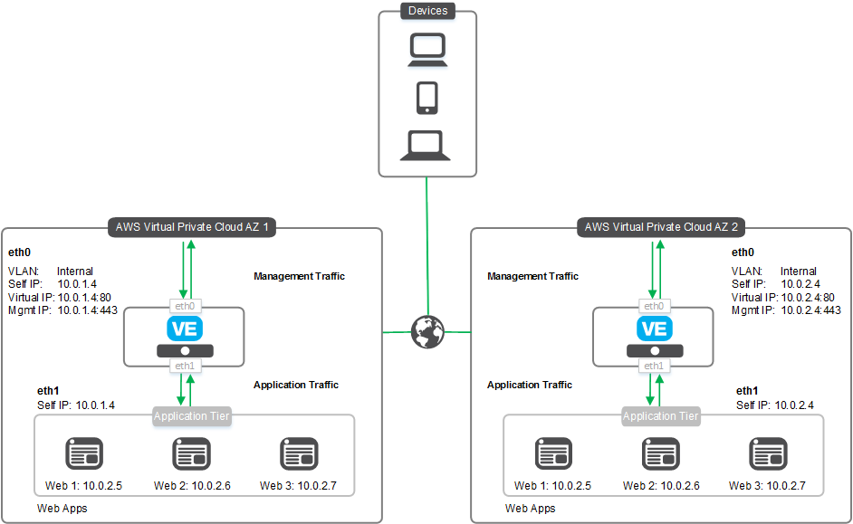

# Deploying the BIG-IP in AWS - Clustered 2-NIC across Availability Zones From AWS Marketplace

[](https://f5cloudsolutions.herokuapp.com)


**Contents**
 - [Introduction](#introduction)
 - [Prerequisites](#prerequisites-and-configuration-notes)
 - [Security](#security)
 - [Getting Help](#getting-help)
 - [Deploying the solution](#deploying-the-solution)
 - [Service Discovery](#service-discovery)
 - [Configuration Example](#configuration-example)
 
## Introduction

This solution uses a CloudFormation Template to launch and configure two BIG-IP 2-NIC VEs in a clustered, highly available configuration across Amazon Availability Zones. The BIG-IP VE can detect Availability Zone failure and automatically shift public traffic to the BIG-IP in the Availability Zone that is unaffected. In a 2-NIC implementation, each BIG-IP VE has one interface used for management and data-plane traffic from the Internet, and the second interface connected into the Amazon networks where traffic is processed by the pool members in a traditional two-ARM design. Traffic flows from the BIG-IP VE to the application servers.  

The BIG-IP VEs have the <a href="https://f5.com/products/big-ip/local-traffic-manager-ltm">Local Traffic Manager</a> (LTM) module enabled to provide advanced traffic management functionality. This means you can also configure the BIG-IP VE to enable F5's L4/L7 security features, access control, and intelligent traffic management.

For information on getting started using F5's CFT templates on GitHub, see [Amazon Web Services: Solutions 101](http://clouddocs.f5.com/cloud/public/v1/aws/AWS_solutions101.html).

When deploying this solution from the AWS Marketplace, you can launch the BIG-IP VE image (Good, Better, or Best) with the following throughput levels: 5Gbps, 1Gbps, 200Mbps, or 25Mbps. Each has a separate page, meaning there are 12 separate Marketplace pages for this solution.


## Prerequisites and configuration notes
The following are prerequisites for the F5 2-NIC CFT:
  - An existing AWS VPC with two separate Availability Zones, each with two subnets: 
    - Management subnet (called Public in the AWS UI). The subnet for the management network requires a route and access to the Internet for the initial configuration to download the BIG-IP cloud library. 
    - External subnet (called Private in the AWS UI). 
  - The AWS VPC must have **DNS Hostnames** enabled, and the VPC DHCP default option *domain-name = <region>.compute.internal domain-name-servers = AmazonProvidedDNS* is required.
  - Key pair for SSH access to BIG-IP VE (you can create or import the key pair in AWS), see http://docs.aws.amazon.com/AWSEC2/latest/UserGuide/ec2-key-pairs.html for information.
  - An AWS Security Group in each Availability Zone with the following inbound rules:
    - Port 22 for SSH access to the BIG-IP VE.
    - Port 8443 (or other port) for accessing the BIG-IP web-based Configuration utility.
    - UDP port 1026 for failover heartbeat.
    - TCP port 4353 for ConfigSync.
    - A port for accessing your applications via the BIG-IP virtual server.
  - This solution uses the SSH key to enable access to the BIG-IP system(s). If you want access to the BIG-IP web-based Configuration utility, you must first SSH into the BIG-IP VE using the SSH key you provided in the template.  You can then create a user account with admin-level permissions on the BIG-IP VE to allow access if necessary.
  - This template supports service discovery.  See the [Service Discovery section](#service-discovery) for details.
  - After deploying the template, if you need to change your BIG-IP VE password, there are a number of special characters that you should avoid using for F5 product user accounts.  See https://support.f5.com/csp/article/K2873 for details.


## Security
This CloudFormation template downloads helper code to configure the BIG-IP system. If you want to verify the integrity of the template, you can open the CFT and ensure the following lines are present. See [Security Details](#security-details) for the exact code in each of the following sections.
  - In the /config/verifyHash section: script-signature and then a hashed signature.
  - In the /config/installCloudLibs.sh section: **tmsh load sys config merge file /config/verifyHash**.
  - In the *filesToVerify* variable: ensure this includes **tmsh run cli script verifyHash /config/cloud/f5-cloud-libs.tar.gz**.
  
  Additionally, F5 provides checksums for all of our supported Amazon Web Services CloudFormation templates. For instructions and the checksums to compare against, see https://devcentral.f5.com/codeshare/checksums-for-f5-supported-cft-and-arm-templates-on-github-1014.
  Note that in order to form a cluster of devices, a secure trust must be established between BIG-IP systems. To establish this trust, we generate and store credentials in an Amazon S3 bucket.

## Supported instance types and hypervisors
  - For a list of supported AWS instance types for this solutions, see the **Amazon EC2 instances for BIG-IP VE** section of https://support.f5.com/kb/en-us/products/big-ip_ltm/manuals/product/bigip-ve-multi-nic-setup-amazon-ec2-13-0-0/1.html

  - For a list versions of the BIG-IP Virtual Edition (VE) and F5 licenses that are supported on specific hypervisors and AWS, see https://support.f5.com/kb/en-us/products/big-ip_ltm/manuals/product/ve-supported-hypervisor-matrix.html.


### Getting Help
**F5 Support**  
Because this template has been created and fully tested by F5 Networks, it is fully supported by F5. This means you can get assistance if necessary from [F5 Technical Support](https://support.f5.com/csp/article/K25327565).

**Community Support**  
We encourage you to use our [Slack channel](https://f5cloudsolutions.herokuapp.com) for discussion and assistance on F5 CloudFormation templates. There are F5 employees who are members of this community who typically monitor the channel Monday-Friday 9-5 PST and will offer best-effort assistance. This slack channel community support should **not** be considered a substitute for F5 Technical Support. See the [Slack Channel Statement](https://github.com/F5Networks/f5-aws-cloudformation/blob/master/slack-channel-statement.md) for guidelines on using this channel.


## Quick Start for launching the template
This Readme file describes launching from the AWS Marketplace (see also [non-marketplace readme](https://github.com/F5Networks/f5-aws-cloudformation/blob/master/supported/cluster/2nic/across-az-ha/readme.md)). You can deploy this solution using one of four different throughput values (25Mbps, 200Mbps, 1000Mbps, 5000Mbps) on one of three different BIG-IP performance types (Good, Better, Best). Use the appropriate AWS Marketplace page for the template you want to launch. 


From the Marketplace for the image you want to use: 
- From the **For Region** list, select your Region. 
- From the **Delivery Methods** list, select **HA across AZs via CFT**
- Click **Continue**
- Select either the **Hourly** or **Yearly** Subscription Term.
- Select the appropriate version.
- Click **Launch the CloudFormation template**.


**Template Parameters**<br>
Once you have launched the CFT from the marketplace, you need to complete the template by entering the required parameter values. The following table can help you gather the information you need before beginning the template.  


| CFT Label | Parameter Name | Required | Description |
| --- | --- | --- | --- |
| VPC | Vpc | Yes | Common VPC for the deployment. |
| Management Subnet AZ1 | managementSubnetAz1 | Yes | Management subnet ID for Availability Zone 1. |
| Management Subnet AZ2 | managementSubnetAz2 | Yes | Management subnet ID for Availability Zone 2. |
| Management Security Group | bigipManagementSecurityGroup | Yes | BIG-IP Management Security Group ID |
| Subnet1 AZ1 | subnet1Az1 | Yes | Public or External subnet ID for Availability Zone 1. |
| Subnet1 AZ1 | subnet1Az2 | Yes | Public or External subnet ID for Availability Zone 2. |
| AWS Instance Size | instanceType | Yes | Size for the F5 BIG-IP virtual instance. |
| SSH Key | sshKey | Yes | Name of an existing EC2 KeyPair to enable SSH access to the instance |
| Source Address(es) for Management Access | restrictedSrcAddress | Yes | The IP address range used for SSH and access the management GUI on the EC2 instances. |
| Source Address(es) for Web Application Access (80/443) | restrictedSrcAddressApp | Yes | The IP address range that can be used to Web traffic (80/443) on the EC2 instances. |
| NTP Server | ntpServer | Yes | NTP server you want to use for this implementation (the default is 0.pool.ntp.org). | 
| Timezone (Olson) | timezone | Yes | Olson timezone string from /usr/share/zoneinfo (the default is UTC). |
| Application | application | No | Application Tag (the default is f5app). |
| Environment | environment | No | Environment Name Tag (the default is f5env). |
| Group | group | No | Group Tag (the default is f5group). |
| Owner | owner | No | Owner Tag (the default is f5owner). |
| Cost Center | costcenter | No | Cost Center Tag (the default is f5costcenter). |
| Send Anonymous Statistics to F5 | allowUsageAnalytics | No | This deployment can send anonymous statistics to F5 to help us determine how to improve our solutions. If you select **No** statistics are not sent. |


<br>


## Service Discovery
Once you launch your BIG-IP instance using the CFT template, you can use the Service Discovery iApp template on the BIG-IP VE to automatically update pool members based on auto-scaled cloud application hosts.  In the iApp template, you enter information about your cloud environment, including the tag key and tag value for the pool members you want to include, and then the BIG-IP VE programmatically discovers (or removes) members using those tags.

### Tagging
In AWS, you have two options for tagging objects that the Service Discovery iApp uses. Note that you select public or private IP addresses within the iApp.
  - *Tag a VM resource*<br>
The BIG-IP VE will discover the primary public or private IP addresses for the primary NIC configured for the tagged VM.
  - *Tag a NIC resource*<br>
The BIG-IP VE will discover the primary public or private IP addresses for the tagged NIC.  Use this option if you want to use the secondary NIC of a VM in the pool.


The iApp first looks for NIC resources with the tags you specify.  If it finds NICs with the proper tags, it does not look for VM resources. If it does not find NIC resources, it looks for VM resources with the proper tags. 

**Important**: Make sure the tags and IP addresses you use are unique. You should not tag multiple AWS nodes with the same key/tag combination if those nodes use the same IP address.

To launch the template:
  1.  From the BIG-IP VE web-based Configuration utility, on the Main tab, click **iApps > Application Services > Create**.
  2.  In the **Name** field, give the template a unique name.
  3.  From the **Template** list, select **f5.service_discovery**.  The template opens.
  4.  Complete the template with information from your environment.  For assistance, from the Do you want to see inline help? question, select Yes, show inline help.
  5.  When you are done, click the **Finished** button.
  
If you want to verify the integrity of the template, from the BIG-IP VE Configuration utility click **iApps > Templates**. In the template list, look for **f5.service_discovery**. In the Verification column, you should see **F5 Verified**.

## Configuration Example

The following is a simple configuration diagram for this clustered, 2-NIC deployment. In this diagram, the IP addresses are provided as examples. This solution creates the instances with the BIG-IP v13.0 AMI image, and uses IAM roles for authentication.<br>



## Security Details
This section has the entire code snippets for each of the lines you should ensure are present in your template file if you want to verify the integrity of the helper code in the template.

**/config/verifyHash section**

Note the hashes and script-signature may be different in your template. The important thing to check is that there is a script-signature line present in the location shown.<br>


```json
"/config/verifyHash": {
                "content": {
                  "Fn::Join": [
                    "\n",
                    [
                      "cli script /Common/verifyHash {",
                      "proc script::run {} {",
                      "    set file_path  [lindex $tmsh::argv 1]",
                      "    set expected_hash 73d01a6b4f27032fd31ea7eba55487430ed858feaabd949d4138094c26ce5521b4578c8fc0b20a87edc8cb0d9f28b32b803974ea52b10038f068e6a72fdb2bbd",
                      "    set computed_hash [lindex [exec /usr/bin/openssl dgst -r -sha512 $file_path] 0]",
                      "    if { $expected_hash eq $computed_hash } {",
                      "        exit 0",
                      "    }",
                      "    exit 1",
                      "}",
                      "    script-signature OGvFJVFxyBm/YlpBsOf8/AIyo5+p7luzrE11v8t7wJ1u24MBeit5pL/McqLxjydPJplymTcJ0qDEtXPZv09TTUF5hrF0g1pJ+z70omzJ6J9kOfOO8lyWP4XU/qM+ywEgAGoc8o8kGjKX01XcmB1e3rq6Mj5gE7CEkxKEcNzF3n5nDIFyBbpG6pJ8kg/7f6gtU14bJo0+ipNAiX+gBmT/10aUKKeJESU5wz+QqnEOE1WuTzdURArxditpk0+qqROZaSULD61w72hEy7kBC/miO+As7q8wjM5/H2yUHLoFLmBWP0jMWqIuzqnG+tgAFjJbZ1UJJDzWiYZK1TG1MsxfPg==",
                      "}"
                    ]
                  ]
                },
                "mode": "000755",
                "owner": "root",
                "group": "root"
              }
```
<br><br>
**/config/installCloudLibs.sh section**


```json
"/config/installCloudLibs.sh": {
                "content": {
                  "Fn::Join": [
                    "\n",
                    [
                      "#!/bin/bash",
                      "echo about to execute",
                      "checks=0",
                      "while [ $checks -lt 120 ]; do echo checking mcpd",
                      "    tmsh -a show sys mcp-state field-fmt | grep -q running",
                      "    if [ $? == 0 ]; then",
                      "        echo mcpd ready",
                      "        break",
                      "    fi",
                      "    echo mcpd not ready yet",
                      "    let checks=checks+1",
                      "    sleep 10",
                      "done",
                      "echo loading verifyHash script",
                      "tmsh load sys config merge file /config/verifyHash",
                      "if [ $? != 0 ]; then",
                      "    echo cannot validate signature of /config/verifyHash",
                      "    exit",
                      "fi",
                      "echo loaded verifyHash",
                      "echo verifying f5-cloud-libs.targ.gz",
                      "tmsh run cli script verifyHash /config/cloud/f5-cloud-libs.tar.gz",
                      "if [ $? != 0 ]; then",
                      "    echo f5-cloud-libs.tar.gz is not valid",
                      "    exit",
                      "fi",
                      "echo verified f5-cloud-libs.tar.gz",
                      "echo expanding f5-cloud-libs.tar.gz",
                      "tar xvfz /config/cloud/f5-aws-autoscale-cluster.tar.gz -C /config/cloud",
                      "tar xvfz /config/cloud/asm-policy-linux.tar.gz -C /config/cloud",
                      "tar xvfz /config/cloud/f5-cloud-libs.tar.gz -C /config/cloud/aws/node_modules",
                      "cd /config/cloud/aws/node_modules/f5-cloud-libs",
                      "echo installing dependencies",
                      "npm install --production /config/cloud/f5-cloud-libs-aws.tar.gz",
                      "touch /config/cloud/cloudLibsReady"
                    ]
                  ]
                },
                "mode": "000755",
                "owner": "root",
                "group": "root"
              }
```


## Filing Issues
If you find an issue, we would love to hear about it. 
You have a choice when it comes to filing issues:
  - Use the **Issues** link on the GitHub menu bar in this repository for items such as enhancement or feature requests and non-urgent bug fixes. Tell us as much as you can about what you found and how you found it.
  - Contact F5 Technical support via your typical method for more time sensitive changes and other issues requiring immediate support.


## Copyright

Copyright 2014-2017 F5 Networks Inc.


## License


### Apache V2.0

Licensed under the Apache License, Version 2.0 (the "License"); you may not use
this file except in compliance with the License. You may obtain a copy of the
License at http://www.apache.org/licenses/LICENSE-2.0

Unless required by applicable law or agreed to in writing, software
distributed under the License is distributed on an "AS IS" BASIS,
WITHOUT WARRANTIES OR CONDITIONS OF ANY KIND, either express or implied.
See the License for the specific language governing permissions and limitations
under the License.

### Contributor License Agreement

Individuals or business entities who contribute to this project must have
completed and submitted the [F5 Contributor License Agreement](http://f5-openstack-docs.readthedocs.io/en/latest/cla_landing.html).