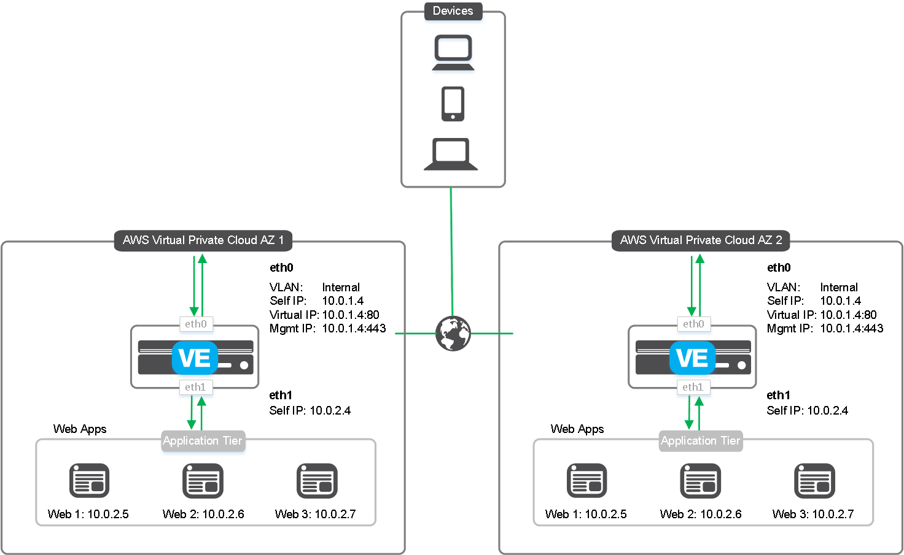

# Deploying the BIG-IP in AWS - Clustered 2 NIC

 
## Introduction

This solution uses a CloudFormation Template to launch and configure two BIG-IP 2-NIC VEs in a clustered, highly available configuration across Amazon Availability Zones. The BIG-IP VE can detect Availability Zone failure and automatically shift public traffic to the BIG-IP in the Availability Zone that is unaffected. In a 2-NIC implementation, each BIG-IP VE has one interface used for management and data-plane traffic from the Internet, and the second interface connected into the Amazon networks where traffic is processed by the pool members in a traditional two-ARM design. Traffic flows from the BIG-IP VE to the application servers.

The **existing stack** CloudFormation template incorporates an existing Virtual Private Cloud (VPC). If you would like to run a *full stack* which creates and configures the BIG-IP, the AWS infrastructure, as well as a backend webserver, see the templates located in the *learning-stacks* folder in the **Experimental** directory.

See the [Configuration Example](#config) section for a configuration diagram and description for this solution.

### Help
We encourage you to use our [Slack channel](https://f5cloudsolutions.herokuapp.com) for discussion and assistance on F5 CloudFormation templates.  This channel is typically monitored Monday-Friday 9-5 PST by F5 employees who will offer best-effort support.  
While this template has been created by F5 Networks, it is in the experimental directory and therefore has not completed full testing and is subject to change.  F5 Networks does not offer technical support for templates in the experimental directory. For supported templates, see the templates in the **supported** directory.

## Installation

You have two options for deploying this template: 
  - Using the AWS deploy buttons 
  - Using [CLI Tools](#cli)

### Using the AWS deploy buttons
The easiest way to deploy one of the CloudFormation templates is to use the appropriate Launch button. 
**Important**: You may have to select the AWS region in which you want to deploy after clicking the Launch Stack button.

 - Hourly, which uses pay-as-you-go hourly billing
 - [BYOL](#byol) (bring your own license), which allows you to use an existing BIG-IP license.
  

**Hourly deploy button**

Use this button to deploy the **hourly** template: 

 
 

After clicking the Launch button, you must specify the following parameters.
 

| Parameter | Required | Description |
| --- | --- | --- |
| bigipExternalSecurityGroup | x | Public or External Security Group ID |
| bigipManagementSecurityGroup | x | BIG-IP Management Security Group ID |
| imageName | x | F5 BIG-IP Performance Type |
| instanceType | x | BIG-IP virtual instance type |
| managementSubnetAz1 | x | Management subnet ID |
| restrictedSrcAddress | x | The IP address range that can be used to SSH to the EC2 instances |
| sshKey | x | Name of an existing EC2 KeyPair to enable SSH access to the instance |
| subnet1Az1 | x | Public or External subnet ID |
| Vpc | x | Common VPC for the deployment |

 
 
  **BYOL deploy button**

Use this button to deploy the **BYOL** template: 

 
After clicking the Launch button, you must specify the following parameters.

| Parameter | Required | Description |
| --- | --- | --- |
| bigipExternalSecurityGroup | x | Public or External Security Group ID |
| bigipManagementSecurityGroup | x | BIG-IP Management Security Group ID |
| imageName | x | F5 BIG-IP Performance Type |
| instanceType | x | BIG-IP virtual instance type |
| licenseKey1 | x | Type or paste your F5 BYOL regkey here |
| licenseKey2 | x | Type or paste your F5 BYOL regkey here |
| managementSubnetAz1 | x | Management subnet ID |
| managementSubnetAz2 | x | Management subnet ID |
| restrictedSrcAddress | x | The IP address range that can be used to SSH to the EC2 instances |
| sshKey | x | Name of an existing EC2 KeyPair to enable SSH access to the instance |
| subnet1Az1 | x | Public or External subnet ID |
| subnet1Az2 | x | Public or External subnet ID |
| Vpc | x | Common VPC for the deployment |

### AWS CLI Usage
Coming soon

## Configuration Example <a name="config">

The following is a simple configuration diagram for this clustered, 2-NIC deployment. In this diagram, the IP addresses are provided as examples. This solution creates the instances with the BIG-IP v13.0 AMI image, and uses IAM roles for authentication. 

## Design Patterns

The goal is for the design patterns for all the iterative examples of F5 being deployed via ARM templates to closely match as much as possible.

### List of Patterns For Contributing Developers

 1. Still working on patterns to use

## Filing Issues

See the Issues section of `Contributing <CONTRIBUTING.md>`__.

## Contributing

See `Contributing <CONTRIBUTING.md>`__

## Test

Before you open a pull request, your code must have passed a deployment into Azure with the intended result

## Unit Tests

Simply deploying the ARM template and completing use case fulfills a functional test

## Copyright

Copyright 2014-2016 F5 Networks Inc.

## License

Apache V2.0
~~~~~~~~~~~
Licensed under the Apache License, Version 2.0 (the "License"); you may not use
this file except in compliance with the License. You may obtain a copy of the
License at

http://www.apache.org/licenses/LICENSE-2.0

Unless required by applicable law or agreed to in writing, software
distributed under the License is distributed on an "AS IS" BASIS,
WITHOUT WARRANTIES OR CONDITIONS OF ANY KIND, either express or implied.
See the License for the specific language governing permissions and limitations
under the License.

Contributor License Agreement
~~~~~~~~~~~~~~~~~~~~~~~~~~~~~
Individuals or business entities who contribute to this project must have
completed and submitted the `F5 Contributor License Agreement`