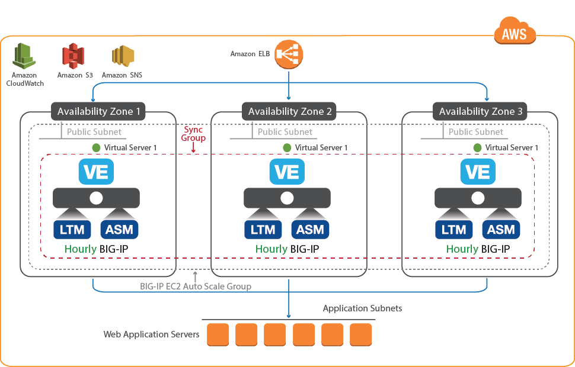

# Auto scaling the BIG-IP VE Web Application Firewall in AWS
[](https://f5cloudsolutions.herokuapp.com)

**Contents**             

 - [Introduction](#introduction) 
 - [Prerequisites](#prerequisites-and-notes)
 - [Quick Start](#quick-start-for-launching-the-template) 
 - [Getting Help](#help)
 - [Additional BIG-IP VE Deployment and Configuration Details](#additional-big-ip-ve-deployment-and-configuration-details)
 - [Security](#security)


## Introduction
This solution implements auto scaling of BIG-IP Virtual Edition (VE) Web Application Firewall (WAF) systems in Amazon Web Services. The BIG-IP VEs have the <a href="https://f5.com/products/big-ip/local-traffic-manager-ltm">Local Traffic Manager</a> (LTM) and <a href="https://f5.com/products/big-ip/application-security-manager-asm">Application Security Manager</a> (ASM) modules enabled to provide advanced traffic management and web application security functionality.  As traffic increases or decreases, the number of BIG-IP VE WAF instances automatically increases or decreases accordingly. 


## Prerequisites and notes
The following are prerequisites for this solution:
 - The appropriate permission in AWS to launch CloudFormation (CFT) templates. You must be using an IAM user with the AdminstratorAccess policy attached and have permission to create Auto Scale Groups, S3 Buckets, Instances, and IAM Instance Profiles.  For details on permissions and all AWS configuration, see https://aws.amazon.com/documentation/.
 - The **sa-east** region does not support using the **m4.xlarge** instance size. If you are using that region, you must select a different instance size. For a list of supported instances and regions, see https://github.com/F5Networks/f5-aws-cloudformation/tree/master/AMI%20Maps.
 - An existing AWS VPC with a public subnet, a classic Elastic load balancer (ELB) in front of the BIG-IP VE(s), and a DNS name for the application pool (which can be also be the DNS name of an ELB if using one behind the BIG-IP(s)). 
   - The classic ELB in front of the BIG-IP VEs must be preconfigured to perform SSL offload for the BIG-IP WAF auto scale tier.  See [ELB configuration](#elb) for an example of the ELB configuration.
 - Access to **Best** BIG-IP images in the Amazon region within which you are working.
 - Accepted the EULA for all Images in the AWS marketplace. If you have not deployed BIG-IP VE in your environment before, search for F5 in the Marketplace and accept the EULA there. 
 - Key pair for SSH access to BIG-IP VE (you can create or import the key pair in AWS), see http://docs.aws.amazon.com/cli/latest/reference/iam/upload-server-certificate.html for information.

 
 
## Quick Start for launching the template
This Readme file describes launching from the AWS Marketplace.

From the Marketplace: 
- From the **For Region** list, select your Region. 
- From the **Delivery Methods** list, select **Auto Scale via CFT**
- Click **Continue**
- Select either the **Hourly** or **Yearly** Subscription Term.
- Select the appropriate version.
- Click **Launch the CloudFormation template**.


### Template Parameters ###
One you have launched the CFT from the marketplace, you need to complete the template by entering the required parameter values. The following table can help you gather the information you need before beginning the template.  


| Parameter | Required | Description |
| --- | --- | --- |
| deploymentName | Yes | Name the template uses to create BIG-IP and AWS object names |
| vpc | Yes | AWS VPC where you want to deploy the BIG-IP VEs |
| availabilityZones | Yes | Availability Zones where you want to deploy the BIG-IP VEs (we recommend at least 2) |
| subnets | Yes | Public or External Subnet for the Availability Zones |
| bigipSecurityGroup | Yes | AWS Security Group for the BIG-IP VEs |
| bigipElasticLoadBalancer | Yes | AWS Elastic Load Balancer group for the BIG-IP VEs |
| sshKey | Yes | EC2 KeyPair to enable SSH access to the BIG-IP instance |
| instanceType | Yes | AWS Instance Type (the default is m4.xlarge) |
| throughput | Yes | For CFTs not launched from the AWS Marketplace: The maximum amount of throughput for the BIG-IP VEs (the default is 1000Mbps) |
| adminUsername | Yes | BIG-IP Admin Username for clustering. Note that the user name can contain only alphanumeric characters, periods ( . ), underscores ( _ ), or hyphens ( - ). Note also that the user name cannot be any of the following: adm, apache, bin, daemon, guest, lp, mail, manager, mysql, named, nobody, ntp, operator, partition, password, pcap, postfix, radvd, root, rpc, rpm, sshd, syscheck, tomcat, uucp, or vcsa. |
| managementGuiPort | Yes | Port of BIG-IP management Configuration utility (the default is 8443) |
| timezone | Yes | Olson timezone string from /usr/share/zoneinfo (the default is UTC) |
| ntpServer | Yes | NTP server for this implementation (Default 0.pool.ntp.org) |
| scalingMinSize | Yes | Minimum number of BIG-IP instances (1-8) to be available in the Auto Scaling Group (we recommend starting with 1 and increasing to at least 2. This can be performed by [updating the stack](#update) |
| scalingMaxSize | Yes | Maximum number of BIG-IP instances (2-8) that can be created in the Auto Scaling Group (the default is 3) |
| scaleDownBytesThreshold | Yes | Incoming Bytes Threshold to begin scaling down BIG-IP Instances (the default is 10000)<sup>1</sup> |
| scaleUpBytesThreshold | Yes | Incoming Bytes Threshold to begin scaling up BIG-IP Instances (the default is 35000)<sup>1</sup> |
| notificationEmail | Yes | Valid email address to send Auto Scaling Event Notifications |
| virtualServicePort | Yes | Port on BIG-IP (the default is 80) |
| applicationPort | Yes | Application Pool Member Port on BIG-IP (the default is 80) |
| appInternalDnsName | Yes | DNS name for the application pool |
| [policyLevel](#security-blocking-levels-) | Yes | WAF Policy Level to protect the application (the default is high) |
| application | No | Application Tag (the default is f5app) |
| environment | No | Environment Name Tag (the default is f5env) |
| group | No | Group Tag (the default is f5group) |
| owner | No | Owner Tag (the default is f5owner) |
| costcenter | No | Cost Center Tag (the default is f5costcenter) |
<br>


<sup>1</sup> Note about the Scaling Up/Down Thresholds:

The default template values are set artificially low for testing.<br>
The Marketplace templates defaults are set to 80% and 20% respectively.<br> 
To adjust the thresholds,  set them according to the utility size (optional).<br> 
For example, if you wanted use different percentages in the scaling threshold(s), modify the ***.80*** or ***.20*** in the following calculations to represent the percentage you want to use. Then take the result and use that as the appropriate threshold value in the CFT.

*Scale Up Bytes Thresholds:* <br>
25 Mbps   = 3276800 bytes   * ***.80*** =   2621440<br>
200 Mbps  = 26214400 bytes  * ***.80*** =  20971520<br>
1000 Mbps = 131072000 bytes * ***.80*** = 104857600<br>
 
*Scale Down Bytes Thresholds:*<br>
25 Mbps   = 3276800 bytes   * ***.20*** =   655360<br>
200 Mbps  = 26214400 bytes  * ***.20*** =  5242880<br>
1000 Mbps = 131072000 bytes * ***.20*** = 26214400<br>

---


### Logging into the BIG-IP device

Once you have completed the template and the BIG-IP system instantiates *(estimated at about 20 minutes)*, use the following guidance to access the BIG-IP VE.

  - Find the IP address of the BIG-IP VE<br> You can find the BIG-IP IP address (Instance IP or Public IP) on the Instances tab of the Auto Scale group created by the template (From the AWS console, click **EC2 > Auto Scaling > Auto Scaling Groups > Instances tab > Instance ID**)

  - SSH to the Instance or Public IP address using the following syntax:<br>``` >ssh -i ~/.ssh/<YOUR-PRIVATE-SSH-KEY-HERE> admin@<INSTANCE IP> ```
  - Create a custom-admin user using the following syntax:<br> ``` #tmsh create auth user my-custom-admin partition-access add { all-partitions { role admin } } prompt-for-password```
 
  - Once you have accessed the BIG-IP using SSH, you can log into the BIG-IP web-based Configuration utility using: **https://(IP Address of the instance):8443**. 

<a name="note"></a>
<br>
**Note**: If you want access to the BIG-IP web-based Configuration utility, you must first SSH into the BIG-IP VE using the SSH key you provided in the template as described in this section.  You can then create a user account with admin-level permissions on the BIG-IP VE to allow access to the Configuration utility if necessary.  In this deployment, the BIG-IP Configuration utility port is 8443 by default.


You can now configure the BIG-IP VE as applicable for your configuration.  See the BIG-IP documentation for details (https://support.f5.com/csp/tech-documents)


---

### Help <a name="help"></a>
Because this template has been created and fully tested by F5 Networks, it is supported by F5. This means you can get assistance if necessary from F5 Technical Support. You can modify the template itself if necessary, but if you modify any of the code between ### START CUSTOM TMSH CONFIGURATION and ### END CUSTOM TMSH CONFIGURATION the template is no longer supported by F5.

We encourage you to use our [Slack channel](https://f5cloudsolutions.herokuapp.com) for discussion and assistance on F5 CloudFormation templates.  This channel is typically monitored Monday-Friday 9-5 PST by F5 employees who will offer best-effort support. 

---
---

## Additional BIG-IP VE deployment and configuration details 

All BIG-IP VE instances deploy with a single interface (NIC) attached to a public subnet. This single interface processes both management and data plane traffic. The LTM and ASM provide advanced traffic management and security functionality. The CloudFormation template collects some initial deployment input parameters and creates an auto scale group of BIG-IP VEs. The instances parameters and configurations are defined by the Auto Scale group's *launch configuration*. The launch configuration is used to:

  - Set the BIG-IP system information: hostname, NTP, DNS settings, and so on.
  - Provision the WAF module: BIG-IP Application Security Manager (ASM)
  - Join the auto scale cluster
  - Deploy integration with EC2 Auto Scale and CloudWatch services for scaling of the BIG-IP tier.
  - Create an initial HTTP virtual server with a basic Web Application Firewall policy (Low, Medium, High)
    - See the [Security Blocking Levels](##security-blocking-levels-) section for a description of the blocking levels for the Web Application Firewall presented in the template.

The CloudFormation template uses the default **Best** image available in the AWS marketplace to license these modules (you can choose 1000, 200, or 25 Mbps). Once the first instance is deployed, it becomes the cluster primary and all subsequent instances launched will join a cluster primary to pull the latest configuration from the cluster. In this respect, you can make changes to the running configuration of this cluster and not have to manage the lifecycle of the configuration strictly through the Launch Configuration.  

#### Configuration Example <a name="config"></a>


The following is a simple configuration diagram of this deployment. 





#### Detailed clustering information
This solution creates a clustered system with "AutoSync" enabled, so any change is immediately propagated throughout the cluster. Each cluster member instance reports "Active" and "Actively" processes traffic.  Although Autosync is enabled and technically you can make changes to any existing clustered member, for consistency we recommend you make any changes to the original, primary instance.

Note: There is no indication of the "primary" instance in the BIG-IP Configuration utility itself; this is simply an administrative designation in this deployment. To determine the primary instance, look for instance with *Scale-In Protection*.  You can find the Scale-In Protection value in AWS by clicking **Auto Scaling Groups** > *Click your Auto Scale group* > **Instances Tab**, and then under the Protected From tab, look for the instance with **Scale-In**.  

When the first auto scale instance is launched, a Device Group called "autoscale-group" is automatically created. 

Whenever a new instance is launched, it joins the cluster. If those instances are scaled down, they are removed from the cluster and the original instance remains. The cluster membership is updated once every 10 minutes and sends metrics every 60 seconds using [iCall](https://devcentral.f5.com/icall).

This deployment creates an initial BIG-IP configuration using an [iApp](https://devcentral.f5.com/iapps) that includes a basic virtual service (listening on 0.0.0.0:80) with a WAF policy.   

After the first instance is launched, you can log in and customize the configuration (for example substitute a custom policy, add logging, and much more).

---

### How this solution works

The CloudFormation Template creates and leverages several AWS resources to support Auto Scale, including:

  - S3 Bucket<br>
    The S3 bucket acts as persistent storage for the cluster database. It contains:
      - *Records*<br>
      Records, named for the instance ID contain metadata for each instance. For example  ```{"privateIp":"10.0.11.190","mgmtIp":"10.0.11.190","hostname":"ip-10-0-11-190.ec2.internal","isMaster":true}```<br>
      Newly launched instances query this bucket for an existing cluster and use information found here to join the cluster. If it it the first member launched in the group, it creates a record with "isMaster":true. Otherwise, it enters itself as "isMaster":false.
      - *Auto-generated credentials for clustering*<br>
      The S3 bucket also contains auto-generated credentials for clustering, for example 
      ```
      {"username":"custom-admin","password":"J#\"?}$YDgb8c=L>>P8#FzmS$WB9EYzx3<"}
      ```
  - IAM Role<br>
  The IAM Role is used to create Instance Profile. The instance profile allows the auto scaled BIG-IP instances to access / update the S3 Bucket, query the Auto Scale Group, and upload metrics to Cloudwatch.
  
  - SNS Topic<br>
  The SNS topic is used to notify the admin via email of Scale Up / Down events.
  - Cloudwatch Alarms<br>
  These alarms are used to trigger scale Up / Down events.
  - Auto Scale Group<br>
  By default, the number of auto scaled instances is set to 1 and the maximum is set to 8. We recommend you launch the solution with 1 instance to start, and increasing this to at least two by [updating the stack](#update). 

---

### Restoring or upgrading the solution <a name="update"></a>
Certain elements of this deployment can be updated with the CloudFormation stack itself. This is referred to as *Updating the Stack*. For instance, anything that causes the Auto Scale Launch Configuration to update, like changing the AMI IDs (to upgrade from one BIG-IP version to another), instance sizes, scaling thresholds, and many others, requires updating the stack. 
 
Clustering is only done within a Launch Configuration ID basis, so any changes that result in a new Launch Configuration ID require the following procedure.
 
  1. Backup your BIG-IP configuration (ideally the cluster primary) by creating a [UCS](https://support.f5.com/csp/article/K13132) archive and store it in the S3 bucket created by the solution in folder called /backup:<br> ```# tmsh save /sys ucs /var/tmp/original.ucs```
    
  2. Update the Stack in AWS (click **CloudFormation > Action > Update Stack**).  
 
  3. The first instance from the new Launch Config becomes the new cluster primary and looks for a UCS in that backup folder for the latest configuration. NOTE: It selects the UCS with the latest timestamp. All subsequent instances from that launch config then sync the latest configuration from the cluster primary as usual. 

---
### Removing the deployment

To remove the deployment, there are few objects that need to be removed manually before you can delete the stack associated with the clustered auto scale BIG-IP CloudFormation template.  

1. Remove Scale-In Protection 
You must first remove "Instance Teardown" Protection on one of the auto scaled instances launched. From the AWS Console, click **EC2 > Auto Scaling Groups >** *Select your BIG-IP auto scale Group* **> Instances Tab >** *Select the Instance with "Scale-In" in the "Protected From" Tab*.  Right Click or select the Actions Tab and then click **Instance Protection > Remove Scale-In Protection**

2. Delete the S3 Bucket
This deployment creates an S3 bucket using the following naming convention: *(your-deploymentName)-autoscale-bigip-s3bucket-52byo83nzxlu*.  To delete the S3 bucket, go to the S3 page in the AWS Console, and then click **Bucket > Empty Bucket**.


3. Delete the CloudFormation stack
In the AWS Console, navigate to the CloudFormation page, select the stack created with the f5-autoscale-bigip.template and delete the stack by right-clicking or (selecting the Actions tab) and then clicking **Delete Stack**.

---

## Security
This CloudFormation template downloads helper code to configure the BIG-IP system. To verify the integrity of the template, you can open the CFT and ensure the following lines are present. See [Security Detail](#securitydetail) for the exact code in each of the following sections.
  - In the */config/verifyHash* section: **script-signature** and then a hashed signature
  - In the */config/installCloudLibs.sh* section **"tmsh load sys config merge file /config/verifyHash"**
  
Additionally, F5 provides checksums for all of our supported Amazon Web Services CloudFormation templates. For instructions and the checksums to compare against, see https://devcentral.f5.com/codeshare/checksums-for-f5-supported-cft-and-arm-templates-on-github-1014.

In order to form a cluster of devices, a secure trust must be established between BIG-IP systems. To establish this trust, we generate and store credentials in an Amazon S3 bucket. You must not delete these credentials from the S3 bucket.

---

### Security blocking levels <a name="blocking"></a>
The security blocking level you choose when you configure the template determines how much traffic is blocked and alerted by the F5 WAF.

Attack signatures are rules that identify attacks on a web application and its components. The WAF has at least 2600 attack signatures available. The higher the security level you choose, the more traffic that is blocked by these signatures.

| Level | Details |
| --- | --- |
| Low | The fewest attack signatures enabled. There is a greater chance of possible security violations making it through to the web applications, but a lesser chance of false positives. |
| Medium | A balance between logging too many violations and too many false positives. |
| High | The most attack signatures enabled. A large number of false positives may be recorded; you must correct these alerts for your application to function correctly. |

All traffic that is not being blocked is being used by the WAF for learning. Over time, if the WAF determines that traffic is safe, it allows it through to the application. Alternately, the WAF can determine that traffic is unsafe and block it from the application.


---


## Security Details <a name="securitydetail"></a>
This section has the entire code snippets for each of the lines you should ensure are present in your template file if you want to verify the integrity of the helper code in the template.

**/config/verifyHash section**

Note the hashes and script-signature may be different in your template. It is important to check there is a script-signature line present in the location shown.<br>


```json
"/config/verifyHash": {
                "content": {
                  "Fn::Join": [
                    "\n",
                    [
                      "cli script /Common/verifyHash {",
                      "proc script::run {} {",
                      "        if {[catch {",
                      "            set hashes(f5-cloud-libs.tar.gz) a6a9db3b89bbd014413706f22fa619c3717fac41fc99ffe875589c90e9b85a05cea227c134ea6e5b519c8fee0d12f2175368e75917f31f447ece3d92f31814af",
                      "            set hashes(f5-cloud-libs-aws.tar.gz) 90058095cc536a057378a90ed19c3afe0cecd9034e1d1816745bd5ad837939623fad034ebd2ee9bdf594f33358b50c50f49a18c2ee7588ba89645142f2217330",
                      "            set hashes(asm-policy-linux.tar.gz) 63b5c2a51ca09c43bd89af3773bbab87c71a6e7f6ad9410b229b4e0a1c483d46f1a9fff39d9944041b02ee9260724027414de592e99f4c2475415323e18a72e0",
                      "            set hashes(f5.http.v1.2.0rc4.tmpl) 47c19a83ebfc7bd1e9e9c35f3424945ef8694aa437eedd17b6a387788d4db1396fefe445199b497064d76967b0d50238154190ca0bd73941298fc257df4dc034",
                      "            set hashes(f5.http.v1.2.0rc6.tmpl) 811b14bffaab5ed0365f0106bb5ce5e4ec22385655ea3ac04de2a39bd9944f51e3714619dae7ca43662c956b5212228858f0592672a2579d4a87769186e2cbfe",
                      "",
                      "            set file_path [lindex $tmsh::argv 1]",
                      "            set file_name [file tail $file_path]",
                      "",
                      "            if {![info exists hashes($file_name)]} {",
                      "                tmsh::log err \"No hash found for $file_name\"",
                      "                exit 1",
                      "            }",
                      "",
                      "            set expected_hash $hashes($file_name)",
                      "            set computed_hash [lindex [exec /usr/bin/openssl dgst -r -sha512 $file_path] 0]",
                      "            if { $expected_hash eq $computed_hash } {",
                      "                exit 0",
                      "            }",
                      "            tmsh::log err \"Hash does not match for $file_path\"",
                      "            exit 1",
                      "        }]} {",
                      "            tmsh::log err {Unexpected error in verifyHash}",
                      "            exit 1",
                      "        }",
                      "    }",
                      "    script-signature OmyfJKVQkBj+Ks6SdIc2+UNxM2xFCK4MGizGysivShzeRof0EFlEUTQiZveZ4v2SElofUp5DMVKiTIIkM00kZ7LnwqvLYIOztDFNAtMGwO6/B/zA8jLhkfnA2xzxu9fFgFn3OEsc8QwbfFS1AqCMyyacbbiczJycHtu3z0a/8sqCgiZtcQ4iXqBP4fz+8HKLA36U0jpmW+z0gQQUwpiC+AfFWcAarXMtmpwLzScldnaZ5RLo0MG8EGrHmXiWjndSR/Ii9b3+vnHnceD6+sw7e7LXPvz+jV9/rFyEQOA1QNpv0Cy4SJcuY9NRjV9KNdBobJ5N+h2PZBlgaIdLMACAVQ==",
                      "}"
                    ]
                  ]
                },
```
<br><br>
**/config/installCloudLibs.sh section**


```json
 "/config/installCloudLibs.sh": {
                "content": {
                  "Fn::Join": [
                    "\n",
                    [
                      "#!/bin/bash",
                      "echo about to execute",
                      "checks=0",
                      "while [ $checks -lt 120 ]; do echo checking mcpd",
                      "    tmsh -a show sys mcp-state field-fmt | grep -q running",
                      "    if [ $? == 0 ]; then",
                      "        echo mcpd ready",
                      "        break",
                      "    fi",
                      "    echo mcpd not ready yet",
                      "    let checks=checks+1",
                      "    sleep 10",
                      "done",
                      "echo loading verifyHash script",
                      "if ! tmsh load sys config merge file /config/verifyHash; then",
                      "    echo cannot validate signature of /config/verifyHash",
                      "    exit",
                      "fi",
                      "echo loaded verifyHash",
                      "declare -a filesToVerify=(\"/config/cloud/f5-cloud-libs.tar.gz\" \"/config/cloud/f5-cloud-libs-aws.tar.gz\")",
                      "for fileToVerify in \"${filesToVerify[@]}\"",
                      "do",
                      "    echo verifying \"$fileToVerify\"",
                      "    if ! tmsh run cli script verifyHash \"$fileToVerify\"; then",
                      "        echo \"$fileToVerify\" is not valid",
                      "        exit 1",
                      "    fi",
                      "    echo verified \"$fileToVerify\"",
                      "done",
                      "mkdir -p /config/cloud/aws/node_modules",
                      "echo expanding f5-cloud-libs.tar.gz",
                      "tar xvfz /config/cloud/f5-cloud-libs.tar.gz -C /config/cloud/aws/node_modules",
                      "tar xvfz /config/cloud/asm-policy-linux.tar.gz -C /config/cloud",
                      "cd /config/cloud/aws/node_modules/f5-cloud-libs",
                      "echo installing dependencies",
                      "npm install --production /config/cloud/f5-cloud-libs-aws.tar.gz",
                      "echo cloud libs install complete",
                      "touch /config/cloud/cloudLibsReady"
                    ]
                  ]
                },
                "mode": "000755",
                "owner": "root",
                "group": "root"
              }
```


---

## Example ELB configuration <a name="elb"></a>
The following is an example ELB configuration that could be used in this implementation. For specific instructions on configuring an ELB, see http://docs.aws.amazon.com/elasticloadbalancing/latest/userguide/load-balancer-getting-started.html.

```json
    "bigipElasticLoadBalancer": {
      "Type": "AWS::ElasticLoadBalancing::LoadBalancer",
      "DependsOn": "internetGatewayAttachment",
      "Properties": {
        "LoadBalancerName": {
          "Fn::Join": [
            "",
            [ 
              { "Ref" : "deploymentName" },
              "-BigipElb"
            ]
          ]
        },
        "HealthCheck": {
          "HealthyThreshold": "2",
          "Interval": "10",
          "Target": "HTTP:80/",
          "Timeout": "5",
          "UnhealthyThreshold": "10"
        },
        "subnets" : [ 
            { "Ref": "az1ExternalSubnet" },
            { "Ref": "az2ExternalSubnet" }
        ],
        "CrossZone" : true,
        "Listeners" : [ {
            "LoadBalancerPort" : "443",
            "InstancePort" : "80",
            "Protocol" : "HTTPS",
            "InstanceProtocol" : "HTTP",
            "SSLCertificateId" : { "Ref" : "certificateId" },
            "PolicyNames" : [
                "ELBSecurityPolicy-2016-08",
                "MyAppCookieStickinessPolicy"
            ]
        } ],
        "Policies" : [
            {
                "PolicyName" : "MyAppCookieStickinessPolicy",
                "PolicyType" : "AppCookieStickinessPolicyType",
                "Attributes" : [
                    { "Name" : "CookieName", "Value" : "MyCookie"}
                ]
            }
        ],
        "SecurityGroups": [
          {
            "Ref": "bigipSecurityGroup"
          }
        ],
        "Tags": [
          {
            "Key": "application",
            "Value": {
              "Ref": "AWS::StackId"
            }
          }
        ]
      }
    },

```

## Filing Issues
If you find an issue, we would love to hear about it. 
You have a choice when it comes to filing issues:
  - Use the **Issues** link on the GitHub menu bar in this repository for items such as enhancement or feature requests and non-urgent bug fixes. Tell us as much as you can about what you found and how you found it.
  - Use our [Slack channel](https://f5cloudsolutions.herokuapp.com) for discussion and assistance on F5 cloud templates.  This channel is typically monitored Monday-Friday 9-5 PST by F5 employees who will offer best-effort support.
  - Contact F5 Technical support via your typical method for more time sensitive changes and other issues requiring immediate support.


## Copyright

Copyright 2014-2017 F5 Networks Inc.


## License


Apache V2.0
~~~~~~~~~~~
Licensed under the Apache License, Version 2.0 (the "License"); you may not use
this file except in compliance with the License. You may obtain a copy of the
License at

http://www.apache.org/licenses/LICENSE-2.0

Unless required by applicable law or agreed to in writing, software
distributed under the License is distributed on an "AS IS" BASIS,
WITHOUT WARRANTIES OR CONDITIONS OF ANY KIND, either express or implied.
See the License for the specific language governing permissions and limitations
under the License.

Contributor License Agreement
~~~~~~~~~~~~~~~~~~~~~~~~~~~~~
Individuals or business entities who contribute to this project must have
completed and submitted the [F5 Contributor License Agreement](http://f5-openstack-docs.readthedocs.io/en/latest/cla_landing.html).
