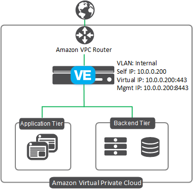

# Deploying the BIG-IP in AWS - Single NIC

[](https://f5cloudsolutions.herokuapp.com)

**Contents**
 - [Introduction](#introduction) 
 - [Prerequisites](#prerequisites-and-notes)
 - [Security](#security)
 - [Getting Help](#help)
 - [Deploying the solution](#deploying-the-f5-single-nic-solution) 
 - [Configuration Example](#configuration-example)

## Introduction
This solution uses a CloudFormation Template to launch a single NIC deployment a BIG-IP VE in an Amazon Virtual Private Cloud. Traffic flows from the BIG-IP VE to the application servers.  This is the standard Cloud design where the compute instance of
F5 is running with a single interface, which processes both management and data plane traffic.  This is a traditional model in the cloud where the deployment is considered one-armed.
 
The **existing stack** CloudFormation template incorporates an existing Virtual Private Cloud (VPC). If you would like to run a *full stack* which creates and configures the BIG-IP, the AWS infrastructure, as well as a backend webserver, see the templates located in the *learning-stacks* folder in the **experimental** directory.

See the **[Configuration Example](#configuration-example)** section for a configuration diagram and more information for this solution.

## Prerequisites and notes
The following are prerequisites for the F5 single NIC CFT:
  - An AWS VPC with one subnet
  - Key pair for SSH access to BIG-IP VE (you can create or import in AWS)
  - An AWS Security Group with the following inbound rules:
    - Port 22 for SSH access to the BIG-IP VE
    - Port 8443 (or other port) for accessing the BIG-IP web-based Configuration utility
    - A port for accessing your applications via the BIG-IP virtual server
  - This solution uses the SSH key to enable access to the BIG-IP system. If you want access to the BIG-IP web-based Configuration utility, you must first SSH into the BIG-IP VE using the SSH key you provided in the template.  You can then create a user account with admin-level permissions on the BIG-IP VE to allow access if necessary.
  
## Security
This CloudFormation template downloads helper code to configure the BIG-IP system. If you want to verify the integrity of the template, you can open the CFT and ensure the following lines are present. See [Security Details](#security-details) for the exact code in each of the following sections.
  - In the */config/verifyHash* section: **script-signature** and then a hashed signature
  - In the */config/installCloudLibs.sh* section **"tmsh load sys config merge file /config/verifyHash"**
  
  Additionally, F5 provides checksums for all of our supported Amazon Web Services CloudFormation templates. For instructions and the checksums to compare against, see https://devcentral.f5.com/codeshare/checksums-for-f5-supported-cft-and-arm-templates-on-github-1014.
  
## Supported instance types and hypervisors
  - For a list of supported AWS instance types for this solutions, see the **Amazon EC2 instances for BIG-IP VE** section of https://support.f5.com/kb/en-us/products/big-ip_ltm/manuals/product/bigip-ve-setup-amazon-ec2-13-0-0/1.html

  - For a list versions of the BIG-IP Virtual Edition (VE) and F5 licenses that are supported on specific hypervisors and AWS, see https://support.f5.com/kb/en-us/products/big-ip_ltm/manuals/product/ve-supported-hypervisor-matrix.html.

### Help 
Because this template has been created and fully tested by F5 Networks, it is fully supported by F5. This means you can get assistance if necessary from F5 Technical Support.

We encourage you to use our [Slack channel](https://f5cloudsolutions.herokuapp.com) for discussion and assistance on F5 CloudFormation templates.  This channel is typically monitored Monday-Friday 9-5 PST by F5 employees who will offer best-effort support. 


## Deploying the F5 single NIC solution
You have two options for launching this solution:
  - Using the [Launch Stack buttons](#installing-the-image-using-the-aws-launch-stack-buttons)
  - Using the [AWS CLI](#installing-the-template-using-the-aws-cli-aws-cli11176) 
  
### Installing the image using the AWS Launch Stack buttons
The easiest way to deploy one of the CloudFormation templates is to use the appropriate Launch Stack button.<br>
**Important**: You may have to select the AWS region in which you want to deploy after clicking the Launch Stack button.

 - Hourly, which uses pay-as-you-go hourly billing
 - [BYOL](#byol-deploy-button) (bring your own license), which allows you to use an existing BIG-IP license.
<br><br>

#### Hourly deploy button

Use this button to deploy the **hourly** template: 

<a href="https://console.aws.amazon.com/cloudformation/home?region=us-east-1#/stacks/new?stackName=BigIp-1nic-Hourly&templateURL=https://s3.amazonaws.com/f5-cft/f5-existing-stack-hourly-1nic-bigip.template">
    
</a>
<br>
<br>

**Hourly Parameters**<br>
After clicking the Launch button, you must specify the following parameters.


| Parameter | Required | Description |
| --- | --- | --- |
| bigipExternalSecurityGroup | Yes | Public or External Security Group ID |
| imageName | Yes | F5 BIG-IP Performance Type |
| instanceType | Yes | BIG-IP virtual instance type |
| managementGuiPort | Yes | Port to use for the management port GUI |
| restrictedSrcAddress | Yes | The IP address range that can be used to SSH to the EC2 instances |
| sshKey | Yes | Name of an existing EC2 KeyPair to enable SSH access to the instance |
| subnet1Az1 | Yes | Public or External subnet ID |
| Vpc | Yes | Common VPC for the deployment |
| ntpServer | Yes | NTP server you want to use for this implementation. The default is 0.pool.ntp.org. | 
| timezone | Yes | Olson timezone string from /usr/share/zoneinfo.  The default is UTC. |
| application | No | Application Tag (the default is f5app) |
| environment | No | Environment Name Tag (the default is f5env) |
| group | No | Group Tag (the default is f5group) |
| owner | No | Owner Tag (the default is f5owner) |
| costcenter | No | Cost Center Tag (the default is f5costcenter) |


<br>


#### BYOL deploy button

Use this button to deploy the **BYOL** template: 

<a href="https://console.aws.amazon.com/cloudformation/home?region=us-east-1#/stacks/new?stackName=BigIp-1nic-BYOL&templateURL=https://s3.amazonaws.com/f5-cft/f5-existing-stack-byol-1nic-bigip.template">
    
</a>
<br>
<br>

**BYOL Parameters**<br>
After clicking the Launch button, you must specify the following parameters.

| Parameter | Required | Description |
| --- | --- | --- |
<<<<<<< HEAD
| bigipExternalSecurityGroup | x | Public or External Security Group ID |
=======
| bigipExternalSecurityGroup | Yes | Public or External Security Group ID |
>>>>>>> joesbranch
| imageName | Yes | F5 BIG-IP Performance Type |
| instanceType | Yes | BIG-IP virtual instance type |
| licenseKey1 | Yes | Type or paste your F5 BYOL regkey here |
| managementGuiPort | Yes | Port to use for the management port GUI |
| restrictedSrcAddress | Yes | The IP address range that can be used to SSH to the EC2 instances |
| sshKey | Yes | Name of an existing EC2 KeyPair to enable SSH access to the instance |
| subnet1Az1 | Yes | Public or External subnet ID |
| Vpc | Yes | Common VPC for the deployment |
<<<<<<< HEAD
| ntpServer | Yes | NTP server you want to use for this implementation | 
=======
| ntpServer | Yes | NTP server you want to use for this implementation. The default is 0.pool.ntp.org. | 
>>>>>>> joesbranch
| timezone | Yes | Olson timezone string from /usr/share/zoneinfo.  The default is UTC. |
| application | No | Application Tag (the default is f5app) |
| environment | No | Environment Name Tag (the default is f5env) |
| group | No | Group Tag (the default is f5group) |
| owner | No | Owner Tag (the default is f5owner) |
| costcenter | No | Cost Center Tag (the default is f5costcenter) |
<<<<<<< HEAD
=======

>>>>>>> joesbranch

---
### Installing the template using the AWS CLI (aws-cli/1.11.76)
If you want to deploy the template using the AWS CLI, use the following example script, replacing the static items (or make them parameters).  Use the following command syntax:
 
```./deploy_via_bash.sh --stackName <value> --licenseType Hourly --sshKey <value> --subnet1Az1 <value> --bigipExternalSecurityGroup <value> --imageName Good200Mbps --Vpc <value> --instanceType t2.medium```

The following is the script file.  This file (**deploy_via_bash.sh**) is also available in this repository.

```bash
#!/bin/bash

## Bash Script to deploy F5 template into AWS, using aws-cli/1.11.76 ##
# Example Command: ./deploy_via_bash.sh --stackName <value> --licenseType Hourly --sshKey <value> --subnet1Az1 <value> --bigipExternalSecurityGroup <value> --imageName Good200Mbps --Vpc <value> --instanceType t2.medium

# Assign Script Parameters and Define Variables
# Specify static items, change these as needed or make them parameters
region="us-west-2"
restrictedSrcAddress="0.0.0.0/0"
tagValues='[{"Key": "application", "Value": "f5app"},{"Key": "environment", "Value": "f5env"},{"Key": "group", "Value": "f5group"},{"Key": "owner", "Value": "f5owner"},{"Key": "costcenter", "Value": "f5costcenter"}]'
ntpServer="0.pool.ntp.org"
timezone="UTC"

# Parse the command line arguments, primarily checking full params as short params are just placeholders
while [[ $# -gt 1 ]]
do
    case "$1" in
        --licenseKey1)
			licenseKey1=$2
			shift 2;;
		--licenseType)
			licenseType=$2
			shift 2;;
		--sshKey)
			sshKey=$2
			shift 2;;
		--subnet1Az1)
			subnet1Az1=$2
			shift 2;;
		--bigipExternalSecurityGroup)
			bigipExternalSecurityGroup=$2
			shift 2;;
		--stackName)
			stackName=$2
			shift 2;;
		--imageName)
			imageName=$2
			shift 2;;
		--Vpc)
			Vpc=$2
			shift 2;;
		--instanceType)
			instanceType=$2
			shift 2;;
		--)
			shift
			break;;
    esac
done

#If a required parameter is not passed, the script will prompt for it below
required_variables="stackName licenseType sshKey subnet1Az1 bigipExternalSecurityGroup imageName Vpc instanceType "
for variable in $required_variables
do
    while [ -z ${!variable} ]
    do
        read -p "Please enter value for $variable:" $variable
    done
done

# Prompt for license key if not supplied and BYOL is selected 
if [ $licenseType == "BYOL" ]
then 
    while [ -z $licenseKey1 ]
    do
        read -p "Please enter value for licenseKey1:" licenseKey1
    done
    
    template="https://s3.amazonaws.com/f5-cft/f5-existing-stack-byol-1nic-bigip.template"
fi 

# Prompt for license bandwidth if not supplied and Hourly is selected 
if [ $licenseType == "Hourly" ]
then 
    while [ -z $imageName ]
    do 
        read -p "Please enter value for imageName:" imageName
    done
    
    template="https://s3.amazonaws.com/f5-cft/f5-existing-stack-hourly-1nic-bigip.template"
fi

echo "Disclaimer: Scripting to Deploy F5 Solution templates into Cloud Environments are provided as examples. They will be treated as best effort for issues that occur, feedback is encouraged."
sleep 3

# Deploy Template
if [ $licenseType == "BYOL" ]
then
    aws cloudformation create-stack --stack-name $stackName --template-url $template --parameters ParameterKey=licenseKey1,ParameterValue=$licenseKey1 ParameterKey=sshKey,ParameterValue=$sshKey ParameterKey=subnet1Az1,ParameterValue=$subnet1Az1 ParameterKey=bigipExternalSecurityGroup,ParameterValue=$bigipExternalSecurityGroup ParameterKey=imageName,ParameterValue=$imageName ParameterKey=Vpc,ParameterValue=$Vpc ParameterKey=instanceType,ParameterValue=$instanceType ParameterKey=restrictedSrcAddress,ParameterValue=$restrictedSrcAddress ParameterKey=ntpServer,ParameterValue=$ntpServer ParameterKey=timezone,ParameterValue=$timezone --tags "$tagValues"

elif [ $licenseType == "Hourly" ]
then
    aws cloudformation create-stack --stack-name $stackName --template-url $template --parameters ParameterKey=sshKey,ParameterValue=$sshKey ParameterKey=subnet1Az1,ParameterValue=$subnet1Az1 ParameterKey=bigipExternalSecurityGroup,ParameterValue=$bigipExternalSecurityGroup ParameterKey=imageName,ParameterValue=$imageName ParameterKey=Vpc,ParameterValue=$Vpc ParameterKey=instanceType,ParameterValue=$instanceType ParameterKey=restrictedSrcAddress,ParameterValue=$restrictedSrcAddress ParameterKey=ntpServer,ParameterValue=$ntpServer ParameterKey=timezone,ParameterValue=$timezone --tags "$tagValues"
else 
    echo "This failure may have been caused by an error in license type: Please ensure license type is either Hourly or BYOL'"
    exit 1
fi

```


## Configuration Example

The following is a simple configuration diagram for this single NIC deployment. In this scenario, all access to the BIG-IP VE appliance is through the same IP address and virtual network interface (vNIC).  This interface processes both management and data plane traffic.
This solution uses the BIG-IP v13.0 AMI image.


### Documentation
The ***BIG-IP Virtual Edition and Amazon Web Services: Single NIC Setup*** guide (https://support.f5.com/kb/en-us/products/big-ip_ltm/manuals/product/bigip-ve-setup-amazon-ec2-12-1-0.html) details how to create the configuration manually without using the CloudFormation template.  This document also describes the configuration in more detail.


## Security Details
This section has the entire code snippets for each of the lines you should ensure are present in your template file if you want to verify the integrity of the helper code in the template.

**/config/verifyHash section**

Note the hashes and script-signature may be different in your template. The important thing to check is that there is a script-signature line present in the location.<br>


```json
"/config/verifyHash": {
                "content": {
                  "Fn::Join": [
                    "\n",
                    [
                      "cli script /Common/verifyHash {",
                      "proc script::run {} {",
                      "    set file_path  [lindex $tmsh::argv 1]",
                      "    set expected_hash 73d01a6b4f27032fd31ea7eba55487430ed858feaabd949d4138094c26ce5521b4578c8fc0b20a87edc8cb0d9f28b32b803974ea52b10038f068e6a72fdb2bbd",
                      "    set computed_hash [lindex [exec /usr/bin/openssl dgst -r -sha512 $file_path] 0]",
                      "    if { $expected_hash eq $computed_hash } {",
                      "        exit 0",
                      "    }",
                      "    exit 1",
                      "}",
                      "    script-signature OGvFJVFxyBm/YlpBsOf8/AIyo5+p7luzrE11v8t7wJ1u24MBeit5pL/McqLxjydPJplymTcJ0qDEtXPZv09TTUF5hrF0g1pJ+z70omzJ6J9kOfOO8lyWP4XU/qM+ywEgAGoc8o8kGjKX01XcmB1e3rq6Mj5gE7CEkxKEcNzF3n5nDIFyBbpG6pJ8kg/7f6gtU14bJo0+ipNAiX+gBmT/10aUKKeJESU5wz+QqnEOE1WuTzdURArxditpk0+qqROZaSULD61w72hEy7kBC/miO+As7q8wjM5/H2yUHLoFLmBWP0jMWqIuzqnG+tgAFjJbZ1UJJDzWiYZK1TG1MsxfPg==",
                      "}"
                    ]
                  ]
                },
                "mode": "000755",
                "owner": "root",
                "group": "root"
              }
```
<br><br>
**/config/installCloudLibs.sh section**


```json
"/config/installCloudLibs.sh": {
                "content": {
                  "Fn::Join": [
                    "\n",
                    [
                      "#!/bin/bash",
                      "echo about to execute",
                      "checks=0",
                      "while [ $checks -lt 120 ]; do echo checking mcpd",
                      "    tmsh -a show sys mcp-state field-fmt | grep -q running",
                      "    if [ $? == 0 ]; then",
                      "        echo mcpd ready",
                      "        break",
                      "    fi",
                      "    echo mcpd not ready yet",
                      "    let checks=checks+1",
                      "    sleep 10",
                      "done",
                      "echo loading verifyHash script",
                      "tmsh load sys config merge file /config/verifyHash",
                      "if [ $? != 0 ]; then",
                      "    echo cannot validate signature of /config/verifyHash",
                      "    exit",
                      "fi",
                      "echo loaded verifyHash",
                      "echo verifying f5-cloud-libs.targ.gz",
                      "tmsh run cli script verifyHash /config/cloud/f5-cloud-libs.tar.gz",
                      "if [ $? != 0 ]; then",
                      "    echo f5-cloud-libs.tar.gz is not valid",
                      "    exit",
                      "fi",
                      "echo verified f5-cloud-libs.tar.gz",
                      "echo expanding f5-cloud-libs.tar.gz",
                      "tar xvfz /config/cloud/f5-aws-autoscale-cluster.tar.gz -C /config/cloud",
                      "tar xvfz /config/cloud/asm-policy-linux.tar.gz -C /config/cloud",
                      "tar xvfz /config/cloud/f5-cloud-libs.tar.gz -C /config/cloud/aws/node_modules",
                      "cd /config/cloud/aws/node_modules/f5-cloud-libs",
                      "echo installing dependencies",
                      "npm install --production /config/cloud/f5-cloud-libs-aws.tar.gz",
                      "touch /config/cloud/cloudLibsReady"
                    ]
                  ]
                },
                "mode": "000755",
                "owner": "root",
                "group": "root"
              }
```


## Filing Issues
If you find an issue, we would love to hear about it. 
You have a choice when it comes to filing issues:
  - Use the **Issues** link on the GitHub menu bar in this repository for items such as enhancement or feature requests and non-urgent bug fixes. Tell us as much as you can about what you found and how you found it.
  - Contact F5 Technical support for more time sensitive changes and other issues requiring immediate support.


## Copyright

Copyright 2014-2017 F5 Networks Inc.


## License


Apache V2.0
~~~~~~~~~~~
Licensed under the Apache License, Version 2.0 (the "License"); you may not use
this file except in compliance with the License. You may obtain a copy of the
License at

http://www.apache.org/licenses/LICENSE-2.0

Unless required by applicable law or agreed to in writing, software
distributed under the License is distributed on an "AS IS" BASIS,
WITHOUT WARRANTIES OR CONDITIONS OF ANY KIND, either express or implied.
See the License for the specific language governing permissions and limitations
under the License.

Contributor License Agreement
~~~~~~~~~~~~~~~~~~~~~~~~~~~~~
Individuals or business entities who contribute to this project must have
completed and submitted the [F5 Contributor License Agreement](http://f5-openstack-docs.readthedocs.io/en/latest/cla_landing.html).
