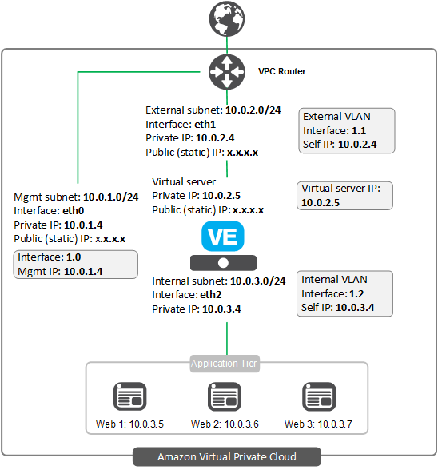

# Deploying the BIG-IP VE in AWS - N NIC (variable number of additional NICs): Existing Stack with BYOL Licensing

[](https://f5cloudsolutions.herokuapp.com)
[](https://github.com/f5networks/f5-aws-cloudformation/releases)
[](https://github.com/f5networks/f5-aws-cloudformation/issues)

**Contents**
 - [Introduction](#introduction)
 - [Prerequisites](#prerequisites)
 - [Important Configuration Notes](#important-configuration-notes)
 - [Security](#security)
 - [Getting Help](#getting-help)
 - [Deploying the solution](#deploying-the-f5-multi-nic-solution)
 - [Service Discovery](#service-discovery)
 - [Configuration Example](#configuration-example)

## Introduction
 
This multi-NIC solution uses a CloudFormation Template to launch a 3-NIC deployment of a BIG-IP VE in an Amazon Virtual Private Cloud, using BYOL (bring your own license) licensing.  This template can optionally also add additional NIC(s) to the BIG-IP VE to be used as needed, up to 5 additional NICs for a total of 8.  

This is an *existing stack* template, meaning the networking infrastructure MUST be available prior to deploying. See the Template Parameters Section for required networking objects. By default, the template will create and attach Public IP Address(es) to the BIG-IP interface(s). Where dictated by security policy or in deployments where accessing resources does not require a Public IP address on the BIG-IP VE, such as users connecting to internal applications using a VPN, set the **provisionPublicIP** parameter to 'No', which will not create Public IP Address(es).

Traffic flows from the BIG-IP VE to the application servers. This is the standard "on-premise like" cloud design where the compute instance of F5 is running with a management, front-end application traffic (virtual server), and a back-end application interface. The BIG-IP VE has the <a href="https://f5.com/products/big-ip/local-traffic-manager-ltm">Local Traffic Manager</a> (LTM) module enabled to provide advanced traffic management functionality. This means you can also configure the BIG-IP VE to enable F5's L4/L7 security features, access control, and intelligent traffic management.

For information on getting started using F5's CFT templates on GitHub, see [Amazon Web Services: Solutions 101](http://clouddocs.f5.com/cloud/public/v1/aws/AWS_solutions101.html).

## Prerequisites
The following are prerequisites for this CFT:
  - An AWS VPC with three subnets: 
    - Management subnet (the subnet for the management network requires a route and access to the Internet for the initial configuration to download the BIG-IP cloud library)
    - External subnet (the subnet for the external network requires a route and access to the Internet for onboarding BIG-IP)
    - Internal subnet  
  - Key pair for management access to BIG-IP VE (you can create or import the key pair in AWS), see http://docs.aws.amazon.com/cli/latest/reference/iam/upload-server-certificate.html for information.
  - Because you are deploying the BYOL template, you must have a valid BIG-IP license token.
  
  
## Important configuration notes
  - All supported versions of F5 CloudFormation templates include Application Services 3 Extension (AS3) v3.5.1 (LTS version) on the BIG-IP VE.  As of release 4.1.2, all supported templates give the option of including the URL of an AS3 declaration, which you can use to specify the BIG-IP configuration you want on your newly created BIG-IP VE(s).  In templates such as autoscale, where an F5-recommended configuration is deployed by default, specifying an AS3 declaration URL will override the default configuration with your declaration.   See the [AS3 documentation](https://clouddocs.f5.com/products/extensions/f5-appsvcs-extension/3.5.1/) for details on how to use AS3.   
  - There are new options for BIG-IP license bundles. See the [the version matrix](https://github.com/F5Networks/f5-aws-cloudformation/blob/master/aws-bigip-version-matrix.md) for details and applicable templates.  
  - Beginning with release 3.3.0, the BIG-IP image names have changed (previous options were Good, Better, and Best).  Now you choose a BIG-IP VE image based on whether you need [LTM](https://www.f5.com/products/big-ip-services/local-traffic-manager) only or All modules available (including [WAF](https://www.f5.com/products/security/advanced-waf), [AFM](https://www.f5.com/products/security/advanced-firewall-manager), etc.), and if you need 1 or 2 boot locations.  Use 2 boot locations if you expect to upgrade the BIG-IP VE in the future. If you do not need room to upgrade (if you intend to create a new instance when a new version of BIG-IP VE is released), use an image with 1 boot location.  See this [Matrix](https://clouddocs.f5.com/cloud/public/v1/matrix.html#amazon-web-services) for recommended AWS instance types.
  - This template creates AWS Security Groups as a part of the deployment. For the external Security Group, this includes a port for accessing your applications on port 80/443.  If your applications need additional ports, you must add those to the external Security Group created by the template.  For instructions on adding ports, see the AWS documentation.
  - This solution uses the SSH key to enable access to the BIG-IP system. If you want access to the BIG-IP web-based Configuration utility, you must first SSH into the BIG-IP VE using the SSH key you provided in the template.  You can then create a user account with admin-level permissions on the BIG-IP VE to allow access if necessary.
  - As a result of this template deploying a variable number of NICs using the value you choose in the **Number of Additional NICs** field, it will preconfigure the BIG-IP VLAN(s) and place the interfaces into the corresponding VLAN (based on the subnet name(s) you specify in the **Additional NIC Location** field).
  - This solution uses an AMI image with BIG-IP v13 or later.  
  - This template supports service discovery.  See the [Service Discovery section](#service-discovery) for details.
  - F5 has created an iApp for configuring logging for BIG-IP modules to be sent to a specific set of cloud analytics solutions.  See [Logging iApp](#logging-iapp).
  - In order to pass traffic from your clients to the servers, after launching the template you must create a virtual server on the BIG-IP VE.  See [Creating a virtual server](#creating-virtual-servers-on-the-big-ip-ve).
  - After deploying the template, if you need to change your BIG-IP VE password, there are a number of special characters that you should avoid using for F5 product user accounts.  See https://support.f5.com/csp/article/K2873 for details.
  - This template can send non-identifiable statistical information to F5 Networks to help us improve our templates.  See [Sending statistical information to F5](#sending-statistical-information-to-f5).
  - F5 has created a matrix that contains all of the tagged releases of the F5 Cloud Formation Templates (CFTs) for Amazon AWS, and the corresponding BIG-IP versions, license types and throughput levels available for a specific tagged release. See https://github.com/F5Networks/f5-aws-cloudformation/blob/master/aws-bigip-version-matrix.md.
  - These CloudFormation templates incorporate an existing Virtual Private Cloud (VPC). If you would like to run a *full stack* which creates and configures the BIG-IP, the AWS infrastructure, as well as a backend webserver, see the templates located in the *learning-stacks* folder in the **experimental** directory.


## Security
This CloudFormation template downloads helper code to configure the BIG-IP system. If you want to verify the integrity of the template, you can open the CFT and ensure the following lines are present. See [Security Details](#security-details) for the exact code in each of the following sections.
  - In the /config/verifyHash section: script-signature and then a hashed signature.
  - In the /config/installCloudLibs.sh section: **tmsh load sys config merge file /config/verifyHash**.
  - In the *filesToVerify* variable: ensure this includes **tmsh run cli script verifyHash /config/cloud/f5-cloud-libs.tar.gz**.
  
Additionally, F5 provides checksums for all of our supported Amazon Web Services CloudFormation templates. For instructions and the checksums to compare against, see https://devcentral.f5.com/codeshare/checksums-for-f5-supported-cft-and-arm-templates-on-github-1014.

## Supported instance types and hypervisors
  - For a list of supported AWS instance types for this solutions, see http://clouddocs.f5.com/cloud/public/v1/aws/AWS_singleNIC.html#amazon-ec2-instances-for-big-ip-ve.

  - For a list versions of the BIG-IP Virtual Edition (VE) and F5 licenses that are supported on specific hypervisors and AWS, see https://support.f5.com/kb/en-us/products/big-ip_ltm/manuals/product/ve-supported-hypervisor-matrix.html.

### Getting Help
**F5 Support**  
Because this template has been created and fully tested by F5 Networks, it is fully supported by F5. This means you can get assistance if necessary from [F5 Technical Support](https://support.f5.com/csp/article/K25327565). You can modify the template itself if necessary, but if you modify any of the code outside of the lines ### START CUSTOM TMSH CONFIGURATION and ### END CUSTOM TMSH CONFIGURATION the template is no longer supported by F5.

**Community Help**  
We encourage you to use our [Slack channel](https://f5cloudsolutions.herokuapp.com) for discussion and assistance on F5 CloudFormation templates. There are F5 employees who are members of this community who typically monitor the channel Monday-Friday 9-5 PST and will offer best-effort assistance. This slack channel community support should **not** be considered a substitute for F5 Technical Support. See the [Slack Channel Statement](https://github.com/F5Networks/f5-aws-cloudformation/blob/master/slack-channel-statement.md) for guidelines on using this channel.

## Deploying the F5 Multi NIC solution
The easiest way to deploy this CloudFormation template is to use the Launch button.<br>
**Important**: You may have to select the AWS region in which you want to deploy after clicking the Launch Stack button.

<a href="https://console.aws.amazon.com/cloudformation/home?region=us-east-1#/stacks/new?stackName=BigIp-n-nic-BYOL&templateURL=https://f5-cft.s3.amazonaws.com/f5-existing-stack-byol-n-nic-bigip.template">
    </a>
<br>

**Template Parameters**<br>
After clicking the Launch button, you must specify the following parameters.  


| CFT Label | Parameter Name | Required | Description |
| --- | --- | --- | --- |
| VPC | Vpc | Yes | Common VPC for the deployment |
| Management Subnet AZ1 | managementSubnetAz1 | Yes | Management subnet ID |
| Subnet1 AZ1 | subnet1Az1 | Yes | Public or External subnet ID |
| Subnet2 AZ1 | subnet1Az1 | Yes | Public or External subnet ID for the second subnet. |
| Subnet1 AZ1 Static IP Addresses |  subnet1Az1Address | No | Optional. If you want to assign static IP address(es) in the subnet, type them here.  Separate multiple IP addresses with a comma (the first is the Primary IP address, all others are Secondary).  Otherwise leave DYNAMIC and a dynamic address is assigned based on the subnet you specified. |
| Number of Additional NICs | numberOfAdditionalNics| Yes | By default this solution deploys the BIG-IP in a 3 NIC configuration, however it will also add a 1-5 additional NICs to the BIG-IP using this parameter. |
| Additional NIC Location | additionalNicLocation | Yes | This parameter specifies where the additional NICs should go.  This value must be a comma delimited string of subnets, equal to the number of additional NICs being deployed.  For example (for 2 additional NICs): **subnet01,subnet02**. NOTE: Ensure that there are no spaces and that the correct number of subnets are provided based on the value you chose in **Number of Additional NICs**. IMPORTANT: The subnet you provide for each additional NIC MUST be unique.
| BIG-IP Image Name | imageName | Yes | Image names starting with **All** have all BIG-IP modules available. Image names starting with **LTM** have only the LTM module available.  Use Two Boot Locations if you expect to upgrade the BIG-IP VE in the future. If you do not need room to upgrade (if you intend to create a new instance when a new version of BIG-IP VE is released), use one Boot Location. |
| Custom Image Id | customImageId | No | This parameter allows you to deploy using a custom BIG-IP image if necessary. If applicable, type the AMI Id in this field. **Note**: Unless specifically required, leave the default of **OPTIONAL**. |
| AWS Instance Size | instanceType | Yes | Size for the F5 BIG-IP virtual instance. |
| License Key1 | licenseKey1 | Yes | Type or paste your F5 BYOL regkey. |
| SSH Key | sshKey | Yes | Name of an existing EC2 KeyPair to enable SSH access to the instance |
| Source Address(es) for Management Access | restrictedSrcAddress | Yes | The IP address range that can be used to SSH to the EC2 instances. |
| Source Address(es) for Web Application Access (80/443) | restrictedSrcAddressApp | Yes | The IP address range that can be used for management access to the EC2 instances. |
| NTP Server | ntpServer | Yes | NTP server you want to use for this implementation (the default is 0.pool.ntp.org). | 
| Timezone (Olson) | timezone | Yes | Enter the Olson timezone string from /usr/share/zoneinfo. The default is 'UTC'. See the TZ column here (https://en.wikipedia.org/wiki/List_of_tz_database_time_zones) for legal values. For example, 'US/Eastern'. |
| BIG-IP Modules | bigIpModules | No | Comma separated list of modules and levels to provision, for example, 'ltm:nominal,asm:nominal' |
| Application | application | No | Application Tag (the default is f5app). |
| Environment | environment | No | Environment Name Tag (the default is f5env). |
| Group | group | No | Group Tag (the default is f5group). |
| Owner | owner | No | Owner Tag (the default is f5owner). |
| Cost Center | costcenter | No | Cost Center Tag (the default is f5costcenter). |
| Send Anonymous Statistics to F5 | allowUsageAnalytics | No | This deployment can send anonymous statistics to F5 to help us determine how to improve our solutions. If you select **No** statistics are not sent. |
| AS3 Declaration URL | declarationUrl | No | URL for the [AS3](https://clouddocs.f5.com/products/extensions/f5-appsvcs-extension/3.5.1/) declaration JSON file to be deployed. Leave as **none** to deploy without a service configuration. |
| Provision Public IP addresses for the BIG-IP interfaces | provisionPublicIP | Yes | Whether or not to provision Public IP Addresses for the BIG-IP Network Interfaces. By Default Public IP address(es) are provisioned. | 
<br>


---

## Service Discovery
Once you launch your BIG-IP instance using the CFT template, you can use the Service Discovery iApp template on the BIG-IP VE to automatically update pool members based on auto-scaled cloud application hosts.  In the iApp template, you enter information about your cloud environment, including the tag key and tag value for the pool members you want to include, and then the BIG-IP VE programmatically discovers (or removes) members using those tags. See our [Service Discovery video](https://www.youtube.com/watch?v=ig_pQ_tqvsI) to see this feature in action.

### Tagging
In AWS, you have two options for tagging objects that the Service Discovery iApp uses. Note that you select public or private IP addresses within the iApp.
  - *Tag a VM resource*<br>
The BIG-IP VE will discover the primary public or private IP addresses for the primary NIC configured for the tagged VM.
  - *Tag a NIC resource*<br>
The BIG-IP VE will discover the primary public or private IP addresses for the tagged NIC.  Use this option if you want to use the secondary NIC of a VM in the pool.


The iApp first looks for NIC resources with the tags you specify.  If it finds NICs with the proper tags, it does not look for VM resources. If it does not find NIC resources, it looks for VM resources with the proper tags. 

**Important**: Make sure the tags and IP addresses you use are unique. You should not tag multiple AWS nodes with the same key/tag combination if those nodes use the same IP address.

To launch the template:
  1.	From the BIG-IP VE web-based Configuration utility, on the Main tab, click **iApps > Application Services > Create**.
  2.	In the **Name** field, give the template a unique name.
  3.	From the **Template** list, select **f5.service_discovery**.  The template opens.
  4.	Complete the template with information from your environment.  For assistance, from the Do you want to see inline help? question, select Yes, show inline help.
  5.	When you are done, click the **Finished** button.
  
If you want to verify the integrity of the template, from the BIG-IP VE Configuration utility click **iApps > Templates**. In the template list, look for **f5.service_discovery**. In the Verification column, you should see **F5 Verified**.

## Creating virtual servers on the BIG-IP VE

In order to pass traffic from your clients to the servers through the BIG-IP system, you must create a virtual server on the BIG-IP VE. To create a BIG-IP virtual server you need to know the AWS secondary private IP address. If you need additional virtual servers for your applications/servers, you can add more secondary private IP addresses in AWS, and corresponding virtual servers on the BIG-IP system. See http://docs.aws.amazon.com/AWSEC2/latest/UserGuide/MultipleIP.html for information on multiple IP addresses.

**To create virtual servers on the BIG-IP system**

1. Once your BIG-IP VE has launched, open the BIG-IP VE Configuration utility.
2. On the Main tab, click **Local Traffic > Virtual Servers** and then click the **Create** button.
3. In the **Name** field, give the Virtual Server a unique name.
4. In the **Destination/Mask** field, type the AWS secondary private IP address.
5. In the **Service Port** field, type the appropriate port. 
6. Configure the rest of the virtual server as appropriate.
7. If you used the Service Discovery iApp template: <br>In the Resources section, from the **Default Pool** list, select the name of the pool created by the iApp.
8. Click the **Finished** button.
9. Repeat as necessary.


### Logging iApp

F5 has created an iApp for configuring logging for BIG-IP modules to be sent to a specific set of cloud analytics solutions. The iApp creates logging profiles which can be attached to the appropriate objects (virtual servers, APM policy, and so on) which results in logs being sent to the selected cloud analytics solution, Azure in this case.

We recommend you watch the [Viewing ASM Data in Azure Analytics video](https://www.youtube.com/watch?v=X3B_TOG5ZpA&feature=youtu.be) that shows this iApp in action, everything from downloading and importing the iApp, to configuring it, to a demo of an attack on an application and the resulting ASM violation log that is sent to ASM Analytics.

**Important**: Be aware that this may (depending on the level of logging required) affect performance of the BIG-IP as a result of the processing to construct and send the log messages over HTTP to the cloud analytics solution.
It is also important to note this cloud logging iApp template is a *different solution and iApp template* than the F5 Analytics iApp template described [here](https://f5.com/solutions/deployment-guides/analytics-big-ip-v114-v1212-ltm-apm-aam-asm-afm).

Use the following guidance using the iApp template (the iApp now is present on the BIG-IP VE image as a part of the templates).

1. Log on to the BIG-IP VE Configuration utility.
2. On the Main tab, from the **iApp** menu, click **Application Services > Applications > Create**.
3. From the **Template** list, select f5.cloud_logger.v1.0.0.tmpl (or later version if applicable).

For assistance running the iApp template, once you open the iApp, from the *Do you want to see inline help?* question, select **Yes, show inline help**.

## Configuration Example

The following is a simple configuration diagram for this N-NIC deployment. In this diagram, the IP addresses are provided as examples.<br>


### More documentation
For more information on F5 solutions for AWS, including manual configuration instructions for many of our AWS templates, see our Cloud Docs site: http://clouddocs.f5.com/cloud/public/v1/.

### Sending statistical information to F5
All of the F5 templates now have an option to send anonymous statistical data to F5 Networks to help us improve future templates.  
None of the information we collect is personally identifiable, and only includes:  

- Customer ID: this is a hash of the customer ID, not the actual ID
- Deployment ID: hash of stack ID
- F5 template name
- F5 template version
- Cloud Name
- AWS region 
- BIG-IP version 
- F5 license type
- F5 Cloud libs version
- F5 script name

This information is critical to the future improvements of templates, but should you decide to select **No**, information will not be sent to F5.

## Security Details
This section has the entire code snippets for each of the lines you should ensure are present in your template file if you want to verify the integrity of the helper code in the template.

**/config/verifyHash section**

Note the hashes and script-signature may be different in your template. The important thing to check is that there is a script-signature line present in the location shown.<br>


```json
"/config/verifyHash": {
                "content": {
                  "Fn::Join": [
                    "\n",
                    [
                      "cli script /Common/verifyHash {",
                      "proc script::run {} {",
                      "    set file_path  [lindex $tmsh::argv 1]",
                      "    set expected_hash 73d01a6b4f27032fd31ea7eba55487430ed858feaabd949d4138094c26ce5521b4578c8fc0b20a87edc8cb0d9f28b32b803974ea52b10038f068e6a72fdb2bbd",
                      "    set computed_hash [lindex [exec /usr/bin/openssl dgst -r -sha512 $file_path] 0]",
                      "    if { $expected_hash eq $computed_hash } {",
                      "        exit 0",
                      "    }",
                      "    exit 1",
                      "}",
                      "    script-signature OGvFJVFxyBm/YlpBsOf8/AIyo5+p7luzrE11v8t7wJ1u24MBeit5pL/McqLxjydPJplymTcJ0qDEtXPZv09TTUF5hrF0g1pJ+z70omzJ6J9kOfOO8lyWP4XU/qM+ywEgAGoc8o8kGjKX01XcmB1e3rq6Mj5gE7CEkxKEcNzF3n5nDIFyBbpG6pJ8kg/7f6gtU14bJo0+ipNAiX+gBmT/10aUKKeJESU5wz+QqnEOE1WuTzdURArxditpk0+qqROZaSULD61w72hEy7kBC/miO+As7q8wjM5/H2yUHLoFLmBWP0jMWqIuzqnG+tgAFjJbZ1UJJDzWiYZK1TG1MsxfPg==",
                      "}"
                    ]
                  ]
                },
                "mode": "000755",
                "owner": "root",
                "group": "root"
              }
```
<br><br>
**/config/installCloudLibs.sh section**


```json
"/config/installCloudLibs.sh": {
                "content": {
                  "Fn::Join": [
                    "\n",
                    [
                      "#!/bin/bash",
                      "echo about to execute",
                      "checks=0",
                      "while [ $checks -lt 120 ]; do echo checking mcpd",
                      "    tmsh -a show sys mcp-state field-fmt | grep -q running",
                      "    if [ $? == 0 ]; then",
                      "        echo mcpd ready",
                      "        break",
                      "    fi",
                      "    echo mcpd not ready yet",
                      "    let checks=checks+1",
                      "    sleep 10",
                      "done",
                      "echo loading verifyHash script",
                      "tmsh load sys config merge file /config/verifyHash",
                      "if [ $? != 0 ]; then",
                      "    echo cannot validate signature of /config/verifyHash",
                      "    exit",
                      "fi",
                      "echo loaded verifyHash",
                      "echo verifying f5-cloud-libs.targ.gz",
                      "tmsh run cli script verifyHash /config/cloud/f5-cloud-libs.tar.gz",
                      "if [ $? != 0 ]; then",
                      "    echo f5-cloud-libs.tar.gz is not valid",
                      "    exit",
                      "fi",
                      "echo verified f5-cloud-libs.tar.gz",
                      "echo expanding f5-cloud-libs.tar.gz",
                      "tar xvfz /config/cloud/f5-aws-autoscale-cluster.tar.gz -C /config/cloud",
                      "tar xvfz /config/cloud/asm-policy-linux.tar.gz -C /config/cloud",
                      "tar xvfz /config/cloud/f5-cloud-libs.tar.gz -C /config/cloud/aws/node_modules",
                      "cd /config/cloud/aws/node_modules/f5-cloud-libs",
                      "echo installing dependencies",
                      "npm install --production /config/cloud/f5-cloud-libs-aws.tar.gz",
                      "touch /config/cloud/cloudLibsReady"
                    ]
                  ]
                },
                "mode": "000755",
                "owner": "root",
                "group": "root"
              }
```


## Filing Issues
If you find an issue, we would love to hear about it. 
You have a choice when it comes to filing issues:
  - Use the **Issues** link on the GitHub menu bar in this repository for items such as enhancement or feature requests and non-urgent bug fixes. Tell us as much as you can about what you found and how you found it.
  - Contact us at [solutionsfeedback@f5.com](mailto:solutionsfeedback@f5.com?subject=GitHub%20Feedback) for general feedback or enhancement requests. 
  - Use our [Slack channel](https://f5cloudsolutions.herokuapp.com) for discussion and assistance on F5 cloud templates. There are F5 employees who are members of this community who typically monitor the channel Monday-Friday 9-5 PST and will offer best-effort assistance.
  - For templates in the **supported** directory, contact F5 Technical support via your typical method for more time sensitive changes and other issues requiring immediate support.


## Copyright

Copyright2014-2019 F5 Networks Inc.


## License


### Apache V2.0

Licensed under the Apache License, Version 2.0 (the "License"); you may not use
this file except in compliance with the License. You may obtain a copy of the
License at

http://www.apache.org/licenses/LICENSE-2.0

Unless required by applicable law or agreed to in writing, software
distributed under the License is distributed on an "AS IS" BASIS,
WITHOUT WARRANTIES OR CONDITIONS OF ANY KIND, either express or implied.
See the License for the specific language governing permissions and limitations
under the License.

### Contributor License Agreement

Individuals or business entities who contribute to this project must have
completed and submitted the F5 Contributor License Agreement.
